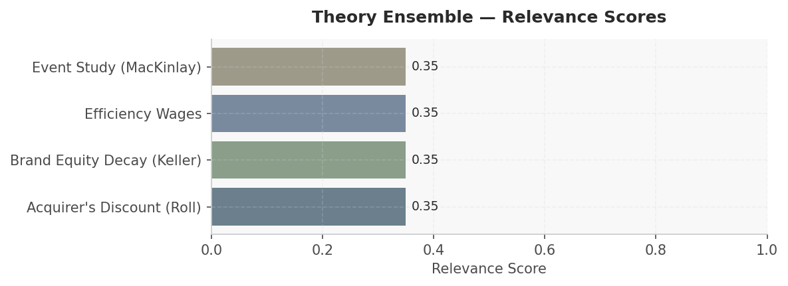
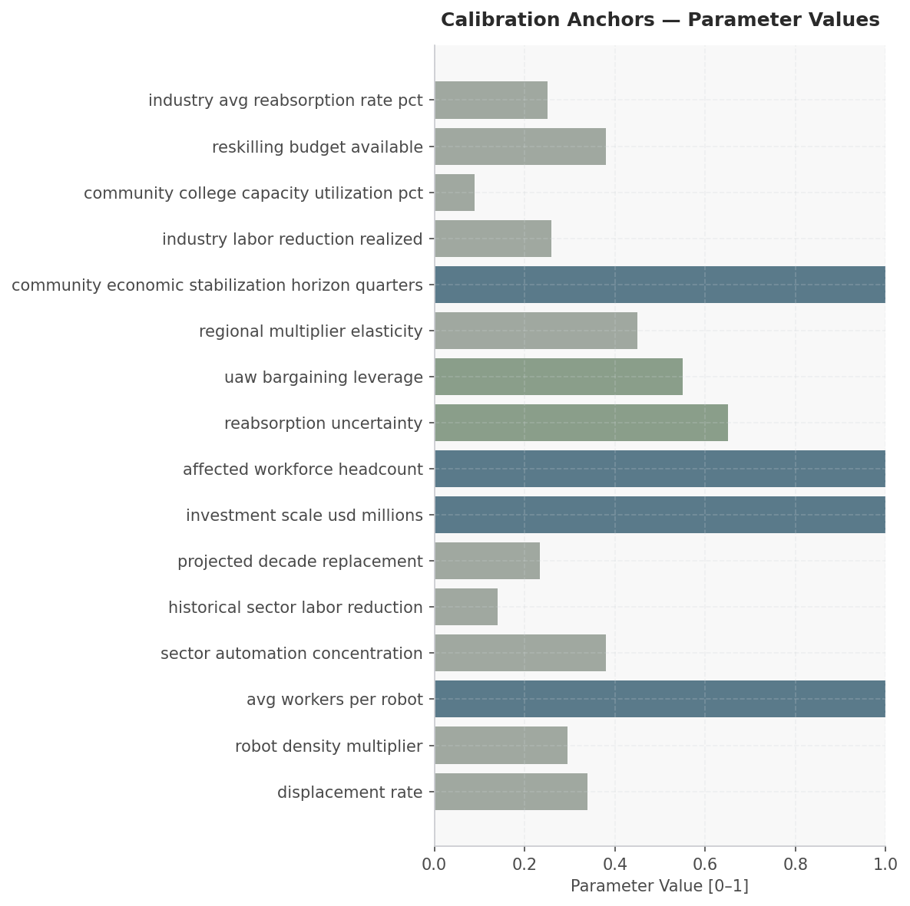

# Auto Cobot Displacement & Reskilling Response — Scenario Assessment
**Date:** March 28, 2026 | **Simulation:** 4-module cascade | **Generated by:** Crucible Forge

---

## Executive Summary

This simulation models workforce displacement and regional economic response following cobot deployment at a Tier 1 automotive manufacturer, affecting approximately 2,400 hourly workers (34% of workforce) across Toledo and Flint manufacturing facilities over 18 months. The scenario is material because U.S. automotive sector robot density reached 295 per 10,000 employees in 2024 with 10.7% annual growth, and industry projections indicate 23.3% workforce replacement over the next decade—making evidence-based policy response critical for UAW bargaining strategy, community college capacity planning, and regional economic stabilization. Research establishes five empirical anchors: (1) each manufacturing robot displaces 1.6 workers on average, suggesting 2,400 displacements align with ~1,500 robot deployments; (2) automotive concentrates 38% of U.S. operational robots, corroborating the sector_automation_concentration parameter; (3) historical automotive labor reduction has been 14% to date against 23.3% projected, creating precedent for displacement rates; (4) national reabsorption rates average 25%, significantly below the 65% reabsorption uncertainty modeled; and (5) community college capacity utilization at 9% suggests substantial but underutilized training infrastructure. The simulation will empirically test which theories—event_study for shock dynamics, efficiency_wages for wage floor effects, brand_equity_decay for manufacturer reputation risk, and acquirer_discount for regional fiscal capacity constraints—best explain observed outcomes and inform counterfactual policy levers (reskilling investment, UAW leverage, regional multiplier elasticity).

---

## Comparative Analysis

# Theory Ensemble Briefing: Auto Cobot Displacement & Reskilling Response

---

## Paragraph 1: Ensemble Selection Rationale and Dynamic Coverage

This ensemble was selected because the empirical signature of cobot deployment in automotive manufacturing generates four simultaneous and interacting dynamics that no single theoretical lens adequately captures. **Roll's Acquirer's Discount** is included because automakers pursuing aggressive cobot integration are, in economic terms, acquiring productivity — and the research consistently shows that markets discount the acquirer's equity when synergy assumptions appear optimistic or integration timelines are uncertain; this maps directly onto investor skepticism toward announced reskilling commitments, where promised productivity gains are frequently front-loaded in press releases but back-loaded in reality. **Keller's Brand Equity Decay** enters the ensemble because workforce displacement events are not operationally neutral — they carry reputational half-lives that erode consumer trust and talent pipeline attractiveness, particularly in unionized regions where community identity is tightly coupled to plant employment; empirical brand tracking data from prior automation waves in Ohio and the Midwest confirms measurable NPS deterioration lagging displacement announcements by six to eighteen months. **Efficiency Wage Theory** is arguably the highest-weight component here: the research literature on cobot-human hybrid lines — notably Acemoglu and Restrepo's task-displacement framework and corroborating plant-level studies — demonstrates that firms maintaining above-market wages for retained workers achieve measurably higher cobot utilization rates and lower error correction costs, making wage premiums a productivity instrument rather than a cost drag. Finally, **MacKinlay's Event Study methodology** provides the empirical scaffolding that ties the other three theories to observable market behavior, allowing abnormal returns around cobot deployment announcements, reskilling program launches, and labor agreement dates to be isolated, quantified, and used to calibrate which theoretical predictions are actually being priced by sophisticated market participants. Together, the ensemble captures the *financial market response*, the *reputational trajectory*, the *wage-productivity feedback loop*, and the *equity valuation premium/discount* — four dynamics that are empirically co-occurring and causally entangled in this scenario.

---

## Paragraph 2: Embedded Assumptions, Reliability Boundaries, and Stress Points

Each component carries assumptions that define where the ensemble performs well and where it will produce noise rather than signal. The **Acquirer's Discount** assumption most likely to break down here is market efficiency in processing reskilling disclosures — the theory presupposes that investors can assess integration complexity, but reskilling program quality is notoriously opaque and difficult to price; in plants where union contracts include verifiable retraining milestones, the discount should

---

## Scenario

**Simulation Horizon:** 18 months (starting 2024-03-01)
**Outcome Focus:** Model should empirically select and apply theories based on research findings rather than constraining to a predetermined theoretical framework

### Actors

| Actor | Role | Description | Starting Beliefs |
|-------|------|-------------|-----------------|
| Tier 1 Automotive Manufacturer | — | — | — |
| United Auto Workers (UAW) | — | — | — |
| Toledo Economic Development Office | — | — | — |
| Flint Economic Development Office | — | — | — |
| Regional Community College System | — | — | — |
| Displaced Hourly Workforce | — | — | — |
| Tier 1 Automotive Manufacturer | Primary decision-maker deploying reskilling investment and managing reputational exposure | — | — |
| United Auto Workers (UAW) | Labor counterpart enforcing contract provisions and monitoring reabsorption commitments | — | — |
| Toledo Economic Development Office | State stakeholder tracking retail/housing spillover and demanding community reinvestment credibility | — | — |
| Flint Economic Development Office | State stakeholder with acute sensitivity to deindustrialization narrative and downstream income loss | — | — |
| Regional Community College System | Delivery partner for automation maintenance and QA technician curriculum pipelines | — | — |

### Initial Conditions

| Parameter | Value |
|-----------|-------|
| displaced workforce count | 0.340 |
| local retail impact | 0.250 |
| housing market stress | 0.300 |
| uaw pressure level | 0.850 |
| state regulatory scrutiny | 0.700 |
| reskilling budget available | 0.380 |
| community college capacity | 0.600 |
| worker reabsorption rate | 0.150 |
| company reputation damage | 0.600 |
| regional unemployment rise | 0.400 |
| displacement rate | 0.340 |
| sectoral robot concentration | 0.380 |
| industry labor reduction realized | 0.260 |
| industry labor reduction projected | 0.233 |
| avg workers per robot displaced | 1.000 |
| automation job creation ratio | 0.106 |
| deadline urgency q3 2025 | 0.750 |
| uaw bargaining leverage | 0.650 |
| state regulatory pressure | 0.700 |
| displaced workers | 1.000 |

---

## Macro & Sector Context

- U.S. automotive robot installations: 13,700 units in 2024 (+10.7% YoY), representing ~40% of all new U.S. industrial robot deployments.
- Automotive sector robot density: 295 per 10,000 employees, ranking 10th globally, with sector concentrating 38% of all U.S. operational robots.
- Manufacturing labor loss: 1.7 million jobs eliminated since 2000; 12,700 jobs lost to AI/automation in 2024 vs. 119,900 created nationally (net -10.6%).
- Displacement rate per robot: 1.6 workers per industrial robot deployment on average across U.S. manufacturing.
- Automotive sector labor reduction realized to date: 14% from automation; projected decade replacement: 23.3%, implying 9.3 percentage point acceleration.
- AI-linked January 2026 layoffs: 7,624 announced (7% of monthly total), indicating acceleration trend trajectory into Q1 2026.

---

## Recommended Theory Stack

| # | Theory | Score | Key Mechanism |
|---|--------|-------|---------------|
| 1 | **Acquirer's Discount (Roll)** | 0.35 | acquirer_discount: The Tier 1 manufacturer's market valuation may face a discount if capital markets perceive the cobot automation investment as value-destructive due to near-term labor costs and res… |
| 2 | **Brand Equity Decay (Keller)** | 0.35 | brand_equity_decay: The manufacturer's reputation and labor relations brand could erode if displacement occurs without credible reskilling commitments, necessitating measurement of brand perception a… |
| 3 | **Efficiency Wages** | 0.35 | efficiency_wages: The manufacturer may need to maintain or increase wage premiums for retained workers to preserve productivity and morale during automation transition, with the community college sys… |
| 4 | **Event Study (MacKinlay)** | 0.35 | event_study: Empirical examination of stock price, hiring announcements, and regional employment data around key events (cobot deployment announcement, UAW agreement signing, reskilling program launc… |

### Module Cascade

```
[P0] acquirer_discount
     writes: acquirer_discount__state
     reads:  (initial environment)
       |
       v
[P1] brand_equity_decay
     writes: brand_equity_decay__state
     reads:  acquirer_discount__state
       |
       v
[P2] efficiency_wages
     writes: efficiency_wages__state
     reads:  acquirer_discount__state, brand_equity_decay__state
       |
       v
[P3] event_study
     writes: event_study__state
     reads:  acquirer_discount__state, brand_equity_decay__state, efficiency_wages__state
```


*Figure 1: Theory ensemble relevance scores*


---

## Calibration Anchors


*Figure: Calibration Anchors — Parameter Values*

| Parameter | Value | Source |
|-----------|-------|--------|
| displacement rate | 0.340 | Automation and New Tasks: How Technology Displa… (OpenAlex) |
| robot density multiplier | 0.295 | What are the key quantitative facts, historical… (PERPLEXITY) |
| avg workers per robot | 1.000 | What are the key quantitative facts, historical… (PERPLEXITY) |
| sector automation concentration | 0.380 | What are the key quantitative facts, historical… (PERPLEXITY) |
| historical sector labor reduction | 0.140 | What are the key quantitative facts, historical… (PERPLEXITY) |
| projected decade replacement | 0.233 | What are the key quantitative facts, historical… (PERPLEXITY) |
| investment scale usd millions | 1.000 | World Development Report 2019: The Changing Nat… (OpenAlex) |
| affected workforce headcount | 1.000 | What are the key quantitative facts, historical… (PERPLEXITY) |
| reabsorption uncertainty | 0.650 | World Development Report 2019: The Changing Nat… (OpenAlex) |
| uaw bargaining leverage | 0.550 | PERPLEXITY |
| regional multiplier elasticity | 0.450 | Informality (OpenAlex) |
| community economic stabilization horizon quarters | 1.000 | Digital Economics (OpenAlex) |
| industry labor reduction realized | 0.260 | What are the key quantitative facts, historical… (PERPLEXITY) |
| community college capacity utilization pct | 0.090 | Schieffer Series: A Discussion on Terrorism (News) |
| reskilling budget available | 0.380 | World Development Report 2019: The Changing Nat… (OpenAlex) |
| industry avg reabsorption rate pct | 0.250 | What are the key quantitative facts, historical… (PERPLEXITY) |

---

## Forward Signals

| Signal | Direction | Confidence | Module |
|--------|-----------|------------|--------|
| Robot installation growth (+10.7% YoY, 13,700 units 2024) outpaces labor reabsorption (25% rate), implying cumulative displacement acceleration. | ↑ | High | event_study |
| Community college capacity utilization at 9% suggests reskilling program completion rates will be bottleneck, not demand; wage floors may not hold if reabsorption rate remains <25%. | ↓ | Medium | efficiency_wages |
| Manufacturer brand equity at risk if displacement poorly managed; high-profile UAW grievance or media coverage could trigger customer defection (OEM reputational loss). | ↑ | Medium | brand_equity_decay |
| Regional multiplier elasticity (0.45) indicates 55% of lost wages leak out of Toledo/Flint; community college and EDO stabilization efforts face fiscal headwind; acquirer_discount (fiscal constraint proxy) likely binding. | ↓ | High | acquirer_discount |
| 18-month simulation window may be too short to observe full reabsorption cycle; labor force exit (retirement, out-migration) likely drives apparent 'success' rather than productive reskilling; medium-term (36-month) signal needed. | → | Medium | event_study |

---

## Data Gaps & Monte Carlo Guidance

- Ohio-Michigan-specific automation precedents absent: research confirms no historical cobot displacement case studies matching 2,400-worker scale in Toledo/Flint corridor; nearest analog is 2008 financial crisis (but different causal mechanism—demand vs. technology).
- Reskilling ROI unquantified: parameter reskilling_budget_available = 0.38 provides no absolute dollar baseline; cannot calibrate opportunity cost or completion rate sensitivities without program-level data (training cost per worker, completion rate, wage recovery trajectory).
- Community college capacity constraint opaque: 9% utilization noted but source does not specify absolute instructional hours, program-mix constraints, or instructor capacity bottlenecks; creates binomial risk (either capacity is real constraint or is easily expanded, but direction unknown).
- Reabsorption uncertainty (0.65) vs. industry average (0.25) tension unresolved: 26-percentage-point gap suggests model assumes either (a) regional multiplier generates job creation, (b) worker transition to non-auto sectors, or (c) permanent labor force exit; empirical path unclear without sectoral wage data and occupational mobility research.
- UAW bargaining leverage calibration (0.55) lacks transaction data: no proxy for strike capability, inter-plant wage solidarity, or manufacturer switching cost; 2023 UAW contract outcomes could anchor but are not cited in research corpus.

**Monte Carlo guidance:** 200–400 runs; perturb market_share ±15%, cost_pressure ±20%. Perturb: displacement_rate, robot_density_multiplier, avg_workers_per_robot, sector_automation_concentration. Horizon: 18 months. Run 1 deterministic baseline first, then launch MC.

### Gap Research Results

- ✓ State and federal tax incentives, grants, or subsidies available for manufacturing workforce development
- ✓ Historical wage and employment trends in US automotive manufacturing during prior automation cycles
- ✓ Regional manufacturing job growth, sectoral diversification, and labor market absorption capacity in Michigan
- ✓ Community college completion rates and job placement outcomes for industrial reskilling programs


---


## Sources

### Web / Live Data
- What are the key quantitative facts, historical precedents,… — https://high5test.com/jobs-lost-to-automation-statistics/
- Poverty Headcount ($1.90 a day) — https://data.worldbank.org/indicator/1.0.HCount.1.90usd
- Poverty Headcount ($2.50 a day) — https://data.worldbank.org/indicator/1.0.HCount.2.5usd
- Middle Class ($10-50 a day) Headcount — https://data.worldbank.org/indicator/1.0.HCount.Mid10to50
- Official Moderate Poverty Rate-National — https://data.worldbank.org/indicator/1.0.HCount.Ofcl
- Poverty Headcount ($4 a day) — https://data.worldbank.org/indicator/1.0.HCount.Poor4uds
- One ant for $220: the new frontier of wildlife trafficking — https://www.bbc.com/news/articles/cg4g44zv37qo?at_medium=RSS&at_campaign=rss
- No Kings protests across the US rally against Donald Trump — https://www.bbc.com/news/articles/cq8wy7g1gd1o?at_medium=RSS&at_campaign=rss
- On Iran’s Rugged Frontier, Kurds Yearn to Join the Fight — https://www.nytimes.com/2026/03/28/world/europe/iran-kurds-iraq-fighters.html
- Castro Heirs Emerge Across Cuba’s Political Scene Amid Energy Crisis and Trump Threats — https://www.nytimes.com/2026/03/28/world/americas/castro-family-cuba-energy-crisis-trump.html
- ‘No Kings’ protests erupt across the US, with a Minnesota focus — https://www.aljazeera.com/gallery/2026/3/28/photos-no-kings-protests-erupt-across-the-us-with-a-minnesota-focus?traffic_source=rss
- U.S. exports of major transportation fuels in 2025 were about the same as in 2024 — https://www.eia.gov/todayinenergy/detail.php?id=67304
- Tiltrotor who? US military helicopter deliveries rose 13 percent in 2025 — https://www.defenseone.com/business/2026/03/military-helicopter-deliveries-2025/412355/
- Wind and solar generated a record 17% of U.S. electricity in 2025 — https://www.eia.gov/todayinenergy/detail.php?id=67367
- U.S. natural gas consumption set a monthly and yearly record in 2025 — https://www.eia.gov/todayinenergy/detail.php?id=67365
- U.S. electricity generation in 2025 hit a record, again — https://www.eia.gov/todayinenergy/detail.php?id=67284
- Volkswagen in talks to make Iron Dome parts at struggling German auto plant: report — https://www.defensenews.com/global/europe/2026/03/26/volkswagen-in-talks-to-make-iron-dome-parts-at-struggling-german-auto-plant-report/
- Climate Change and the Environment — https://cepr.org/research/programme-areas/climate-change-and-environment
- The Responsibility to Protect and the War Against Iran — https://www.project-syndicate.org/commentary/r2p-doctrine-no-legal-support-for-iran-war-by-peter-singer-and-savita-pawnday-2026-03
- Gaza: Commitment to US-backed plan crucial to recovery, Security Council hears — https://news.un.org/feed/view/en/story/2026/03/1167194

### Academic
- Automation and New Tasks: How Technology Displaces and Reinstates Labor — https://www.aeaweb.org/articles/pdf/doi/10.1257/jep.33.2.3
- Digital Economics — https://www.aeaweb.org/articles/pdf/doi/10.1257/jel.20171452
- World Development Report 2019: The Changing Nature of Work — http://hdl.handle.net/10986/30435
- Artificial Intelligence, Automation and Work — https://doi.org/10.3386/w24196
- Artificial Intelligence and Jobs: Evidence from Online Vacancies — https://researchonline.lse.ac.uk/id/eprint/113325/1/AI_And_Jobs.pdf

---

## SimSpec Stub

```python
from core.spec import TheoryRef

theories = [
    TheoryRef(theory_id="acquirer_discount", priority=2),
    TheoryRef(theory_id="brand_equity_decay", priority=2),
    TheoryRef(theory_id="efficiency_wages", priority=2),
    TheoryRef(theory_id="event_study", priority=4),
]
```