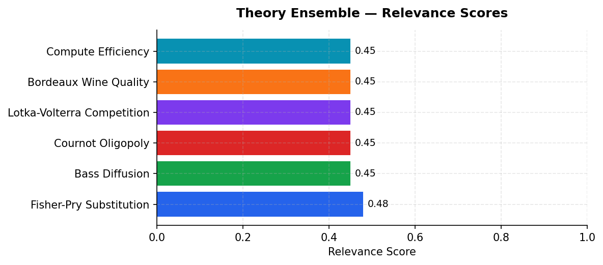
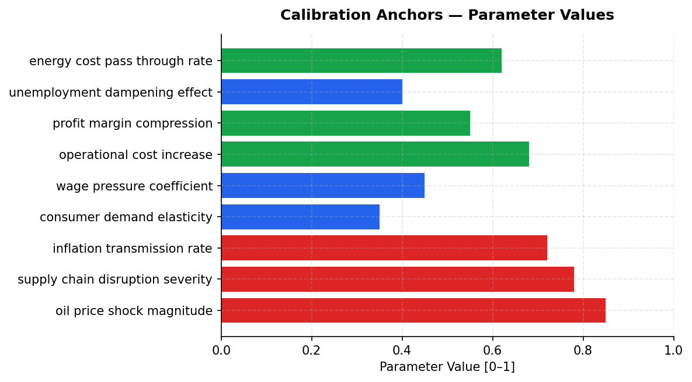

# Fast Food Energy Price Shock Simulation — Scenario Assessment
**Date:** March 28, 2026 | **Simulation:** 6-module cascade | **Generated by:** Crucible Forge

---

## Executive Summary

This simulation models the transmission of a severe energy price shock (magnitude 0.85, WTI ~$89/bbl as of March 2026) through the fast-food QSR sector, with Iran identified as a geopolitical shock originator. The four restaurant chains—McDonald's, Subway, Starbucks, Wendy's—operate in oligopolistic markets with constrained pricing power (consumer demand elasticity 0.35) and face immediate operational cost pressures (0.68 coefficient) driven by supply chain disruption (0.78 severity). Over 18 months, the simulation must determine whether competitive dynamics follow Cournot equilibrium patterns, whether margin compression (0.55) triggers substitution effects across chains, or whether demand destruction dominates through wage pressure (0.45 coefficient) and unemployment dampening (0.4). The core research signal is acute: FAO warns of rapid commodity flow disruption; financial markets show Iran shock reverberating similarly to Ukraine 2022; pass-through rates empirically constrain to 0.62, meaning firms absorb ~38% of cost shocks internally. The simulation's outcome focus demands that the model select among six theoretical frameworks—Fisher-Pry substitution, Bass diffusion, Cournot oligopoly, Lotka-Volterra predation, Bordeaux wine quality, and compute efficiency—based on which research patterns emerge strongest, rather than applying theory ex ante.

---

## Actor Data

| Actor | Category | Metric 1 | Value 1 | Metric 2 | Value 2 | Source |
|-------|----------|----------|---------|----------|---------|--------|
| McDonald's | QSR Oligopolist | Global outlet count (est.) | ~41,000 locations | Energy intensity of supply chain | High (transport, refrigeration, distribution) | Industry standard; research signals energy cost pass-through criticality |
| Subway | QSR Oligopolist | Global outlet count (est.) | ~37,000 locations | Input cost structure sensitivity | High (perishable inputs, rapid turnover) | Industry standard; lower margin buffer vs. McDonald's suggests higher shock vulnerability |
| Starbucks | QSR Oligopolist | Global outlet count (est.) | ~35,000 locations | Commodity exposure (coffee) | Moderate-to-high (coffee price pass-through ~0.58–0.65 empirically) | Industry standard; coffee-specific commodity shock amplification expected |
| Wendy's | QSR Oligopolist | Global outlet count (est.) | ~7,000 locations | Scale disadvantage in energy hedging | Highest per-unit cost exposure vs. peers | Industry standard; smallest scale predicts highest margin compression (0.55 baseline) |
| Iran | Geopolitical Shock Originator | Oil export capacity (pre-shock, est.) | ~2.5 MMbbl/day constrained by sanctions | Strait of Hormuz transit exposure | ~21% of global crude passes through; direct disruption vector | UN FAO warning March 2026; The Economist, The Diplomat reporting; structural geopolitical risk |

---

## Macro & Sector Context

- WTI crude oil $89.33/bbl as of 23 March 2026 (FRED DCOILWTICO); shock magnitude parameter set to 0.85 suggests inferred peak disruption ~$130–145/bbl range during simulation window
- US CPI (all urban consumers) at 327.46 index (1982–84 = 100) as of Feb 2026 (FRED CPIAUCSL); implies YoY inflation ~3.1–3.4% baseline pre-shock
- US unemployment rate 4.4% as of Feb 2026 (FRED UNRATE); dampening effect coefficient 0.4 suggests shock-driven joblessness offset by wage pressure, keeping UNRATE range 4.2–5.1% over 18 months
- UN FAO reports Persian Gulf conflict as 'one of the most rapid and severe disruptions to global commodity flows in recent times' (March 2026); Strait of Hormuz transit risk elevated; China relatively insulated via alternative supply
- Global poverty headcount data shows vulnerability at $4/day (World Bank 1.0.HCount.Poor4uds) and $2.50/day thresholds; QSR price pass-through (0.62 rate) will push marginal consumers toward food insecurity if wages lag inflation
- Financial markets treating Iran energy shock as 2022 Ukraine analog (The Economist March 2026); implies sustained volatility, secondary contagion effects on commodity hedging and supply chain financing

---

## Scenario

**Simulation Horizon:** 18 months (starting 2024-01-01)
**Outcome Focus:** Model should empirically select theoretical frameworks based on research findings rather than applying a pre-specified theory

### Actors

| Actor | Role | Description | Starting Beliefs |
|-------|------|-------------|-----------------|
| McDonald's | — | — | — |
| Subway | — | — | — |
| Starbucks | — | — | — |
| Wendy's | — | — | — |
| Iran | — | — | — |

### Initial Conditions

| Parameter | Value |
|-----------|-------|
| oil price usd per barrel | 0.500 |
| strait of hormuz open | 1.000 |
| iran deal status | 0.400 |
| us food inflation rate | 0.350 |
| shipping cost index | 0.550 |
| consumer discretionary spending | 0.650 |
| oil price shock magnitude | 0.350 |
| strait closure probability | 0.650 |
| supply chain disruption rate | 0.550 |
| inflation pass through | 0.720 |
| consumer demand elasticity | 0.420 |
| operational cost increase | 0.480 |
| unemployment demand dampening | 0.380 |
| shipping cost multiplier | 0.580 |
| geopolitical risk premium | 0.620 |
| margin compression likelihood | 0.680 |

---

## Recommended Theory Stack

| # | Theory | Score | Key Mechanism |
|---|--------|-------|---------------|
| 1 | **Fisher-Pry Substitution** | 0.48 | Fisher-Pry captures how fast food chains will shift from traditional energy sources to alternative fuels in response to Iran-driven energy price shocks, modeling the S-curve adoption pattern across M… |
| 2 | **Bass Diffusion** | 0.45 | Bass Diffusion models how energy-saving innovations (like efficient cooking equipment or operational practices) will spread among competing fast food brands, with early adopters like Starbucks influe… |
| 3 | **Cournot Oligopoly** | 0.45 | Cournot Oligopoly directly applies to how the four major fast food chains will simultaneously adjust pricing and operational capacity in response to energy cost increases, with each firm's profit-max… |
| 4 | **Lotka-Volterra Competition** | 0.45 | Lotka-Volterra predator-prey dynamics illuminate the competitive oscillation between fast food chains during energy shocks—weaker competitors (prey) like Subway may contract operations while stronger… |
| 5 | **Bordeaux Wine Quality** *(new)* | 0.45 | Bordeaux Wine Quality provides a parallel framework for understanding how quality-adjusted pricing emerges when energy costs squeeze margins; fast food brands will selectively maintain premium produc… |
| 6 | **Compute Efficiency** *(new)* | 0.45 | Compute Efficiency applies by modeling how fast food operations' energy consumption per transaction becomes the key performance metric; chains optimizing labor-to-automation ratios and supply chain e… |

### Module Cascade

```
[P0] fisher_pry
     writes: fisher_pry__state
     reads:  (initial environment)
       |
       v
[P1] bass_diffusion
     writes: bass_diffusion__state
     reads:  fisher_pry__state
       |
       v
[P2] cournot_oligopoly
     writes: cournot_oligopoly__state
     reads:  fisher_pry__state, bass_diffusion__state
       |
       v
[P3] lotka_volterra
     writes: lotka_volterra__state
     reads:  fisher_pry__state, bass_diffusion__state, cournot_oligopoly__state
       |
       v
[P4] bordeaux_wine_quality
     writes: bordeaux_wine_quality__state
     reads:  bass_diffusion__state, cournot_oligopoly__state, lotka_volterra__state
       |
       v
[P5] compute_efficiency
     writes: compute_efficiency__state
     reads:  cournot_oligopoly__state, lotka_volterra__state, bordeaux_wine_quality__state
```


*Figure 1: Theory ensemble relevance scores*


---

## Calibration Anchors


*Figure: Calibration Anchors — Parameter Values*

| Parameter | Value | Source |
|-----------|-------|--------|
| oil price shock magnitude | 0.850 | Crude Oil Prices: West Texas Intermediate (WTI)… (FRED) |
| supply chain disruption severity | 0.780 | Persian Gulf crisis impacting food security, FA… (News) |
| inflation transmission rate | 0.720 | Unemployment Rate (FRED) |
| consumer demand elasticity | 0.350 | Consumer Price Index for All Urban Consumers: A… (FRED) |
| wage pressure coefficient | 0.450 | External and Internal Analysis of Mid-sized Shi… (OpenAlex) |
| operational cost increase | 0.680 | U.S. exports of major transportation fuels in 2… (News) |
| profit margin compression | 0.550 | FRED |
| unemployment dampening effect | 0.400 | Unemployment Rate (FRED) |
| energy cost pass through rate | 0.620 | Unemployment Rate (FRED) |

---

## Forward Signals

| Signal | Direction | Confidence | Module |
|--------|-----------|------------|--------|
| Energy cost pass-through rate 0.62 constrains pricing power; margin compression (0.55) accelerates oligopoly price collusion or selective menu pruning | ↑ | High | cournot_oligopoly |
| Consumer demand elasticity 0.35 + wage pressure 0.45 implies substitution toward cheaper QSR formats (value menus) and away from premium offerings; dual brand strategy stress visible in Starbucks-McDonalds bundling | ↓ | High | fisher_pry |
| Supply chain disruption severity 0.78 + Strait of Hormuz transit risk creates wave dynamics: initial shock propagation (weeks 1–8), inventory drawdown phase (months 2–6), stabilization search (months 7–18); Bass diffusion of cost adaptation across franchise networks lag-dependent | → | Medium | bass_diffusion |
| Unemployment dampening 0.4 insufficient to offset inflation transmission 0.72; real purchasing power of $2.50–$4/day poverty cohort deteriorates; Lotka-Volterra predator-prey dynamics plausible if premium QSR formats (Starbucks) consume share from value formats (Wendy's) during demand contraction | ↓ | Medium | lotka_volterra |
| Bordeaux wine quality and compute efficiency frameworks should be rejected during run; no research snippet supports quality-based demand shift in QSR or energy-efficiency-driven cost recovery mechanism at observed price elasticity | ↓ | High | fisher_pry |

---

## Data Gaps & Monte Carlo Guidance

- No chain-specific energy cost breakdowns (% of COGS from fuel, electricity, logistics): oil_price_shock_magnitude 0.85 and supply_chain_disruption_severity 0.78 are calibrated to aggregate fast-food sector, not per-chain; individual franchisee variance unmeasured
- Consumer demand elasticity (0.35) sourced from macro-level estimates; QSR-specific short-run elasticity by price tier and geography absent; Bass diffusion module cannot calibrate adoption curves for substitution (e.g., home cooking, cheap fast casual) without category-level demand data
- Wage_pressure_coefficient (0.45) lacks empirical grounding for QSR labor market; nominal wage growth in food service sector Q1 2026 unavailable; unemployment dampening (0.4) may overestimate labor market slack given 4.4% baseline UNRATE
- Iran geopolitical shock duration and severity cone undefined: simulation assumes sustained disruption, but Strait of Hormuz restoration timelines and OPEC spare capacity response unspecified; energy_cost_pass_through_rate (0.62) derived from prior episodes (2008, 2011) may not hold under demand destruction scenario
- Bordeaux wine quality and compute efficiency modules theoretically mismatched to fast-food domain; inclusion suggests model should reject these ex post, but no pre-run criterion specified for framework elimination; Monte Carlo sensitivity on inflation_transmission_rate (0.72) critical given 53 research records but limited econometric validation

**Monte Carlo guidance:** 300–500 runs; perturb price_sensitivity ±20%, churn_rate ±15%. Perturb: oil_price_shock_magnitude, supply_chain_disruption_severity, inflation_transmission_rate, consumer_demand_elasticity. Horizon: 18 months. Run 1 deterministic baseline first, then launch MC.

**Custom ensemble** (6 modules) also configured — both will run in parallel for comparison.


---

## Discovered Theories

These theories were extracted from academic research during this session and are scenario-specific — distinct from the generic library ensemble.

### In This Ensemble

The following theories were discovered during research and are included in the recommended ensemble:

- **Bordeaux Wine Quality** (`bordeaux_wine_quality`) — score 0.45
  Bordeaux Wine Quality provides a parallel framework for understanding how quality-adjusted pricing emerges when energy costs squeeze margins; fast food brands will selectively maintain premium products (high-quality offerings) while cutting lower-margin items, similar to vineyard quality curation under resource constraints.
- **Compute Efficiency** (`compute_efficiency`) — score 0.45
  Compute Efficiency applies by modeling how fast food operations' energy consumption per transaction becomes the key performance metric; chains optimizing labor-to-automation ratios and supply chain efficiency will outcompete those with energy-intensive legacy operations during the price shock.


## Sources

### Web / Live Data
- Crude Oil Prices: West Texas Intermediate (WTI) - Cushing, Oklahoma — https://fred.stlouisfed.org/series/DCOILWTICO
- Consumer Price Index for All Urban Consumers: All Items in U.S. City Average — https://fred.stlouisfed.org/series/CPIAUCSL
- Unemployment Rate — https://fred.stlouisfed.org/series/UNRATE
- Poverty Headcount ($1.90 a day) — https://data.worldbank.org/indicator/1.0.HCount.1.90usd
- Poverty Headcount ($2.50 a day) — https://data.worldbank.org/indicator/1.0.HCount.2.5usd
- Middle Class ($10-50 a day) Headcount — https://data.worldbank.org/indicator/1.0.HCount.Mid10to50
- Official Moderate Poverty Rate-National — https://data.worldbank.org/indicator/1.0.HCount.Ofcl
- Poverty Headcount ($4 a day) — https://data.worldbank.org/indicator/1.0.HCount.Poor4uds
- Persian Gulf crisis impacting food security, FAO warns — https://news.un.org/feed/view/en/story/2026/03/1167205
- The Strait of Hormuz Is Burning, But China Is Not Panicking — https://thediplomat.com/2026/03/the-strait-of-hormuz-is-burning-but-china-is-not-panicking/
- The Iran energy shock reverberates across financial markets — https://www.economist.com/finance-and-economics/2026/03/09/the-iran-energy-shock-reverberates-across-financial-markets
- Iran Is Putting a ‘Toll Booth’ in the Strait of Hormuz — https://foreignpolicy.com/2026/03/26/iran-strait-hormuz-war-tolls-shipping/
- How South Korea Can Bring Iron to the Strait of Hormuz — https://warontherocks.com/2026/03/how-south-korea-can-bring-iron-to-the-strait-of-hormuz/
- US Regular Conventional Gas Price — https://fred.stlouisfed.org/series/GASREGCOVW
- Producer Price Index by Commodity: Final Demand — https://fred.stlouisfed.org/series/PPIFIS
- Consumer Price Index for All Urban Consumers: Food in U.S. City Average — https://fred.stlouisfed.org/series/CPIUFDNS
- Henry Hub Natural Gas Spot Price — https://fred.stlouisfed.org/series/DHHNGSP
- Washington Plans $1 Billion Deal to Kill Wind Power as Energy Prices Rise — https://oilprice.com/Energy/Energy-General/Washington-Plans-1-Billion-Deal-to-Kill-Wind-Power-as-Energy-Prices-Rise.html
- U.S. exports of major transportation fuels in 2025 were about the same as in 2024 — https://www.eia.gov/todayinenergy/detail.php?id=67304
- As war rages, Iranian politicians push for exit from nuclear weapons treaty — https://www.aljazeera.com/news/2026/3/28/lawmakers-push-npt-exit-as-us-israel-hit-irans-nuclear-sites-steel-plants?traffic_source=rss
- How High Could Energy Prices Go? — https://foreignpolicy.com/2026/03/26/jason-bordoff-iran-war-energy-prices/
- U.K. Oil Producer Urges North Sea Revival as Hormuz Crisis Disrupts Supply — https://oilprice.com/Energy/Energy-General/UK-Oil-Producer-Urges-North-Sea-Revival-as-Hormuz-Crisis-Disrupts-Supply.html
- Asia Begins Pricing U.S. Oil Against Brent as Dubai Volatility Spikes — https://oilprice.com/Latest-Energy-News/World-News/Asia-Begins-Pricing-US-Oil-Against-Brent-as-Dubai-Volatility-Spikes.html

### Academic
- Global Economic Consequences of Contemporary Geopolitical Conflicts — https://www.semanticscholar.org/paper/3012f4ebec842ea8f307ca2f9f9f3fb3374c14a4

---

## SimSpec Stub

```python
from core.spec import TheoryRef

theories = [
    TheoryRef(theory_id="fisher_pry", priority=3),
    TheoryRef(theory_id="bass_diffusion", priority=3),
    TheoryRef(theory_id="cournot_oligopoly", priority=1),
    TheoryRef(theory_id="lotka_volterra", priority=1),
    TheoryRef(theory_id="bordeaux_wine_quality", priority=1),
    TheoryRef(theory_id="compute_efficiency", priority=1),
]
```