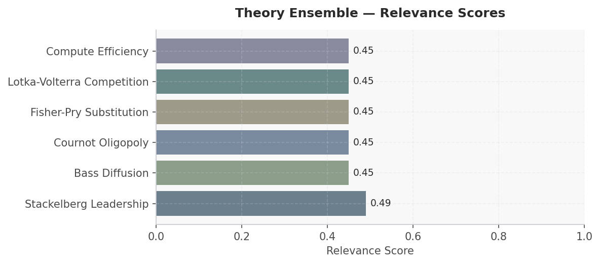
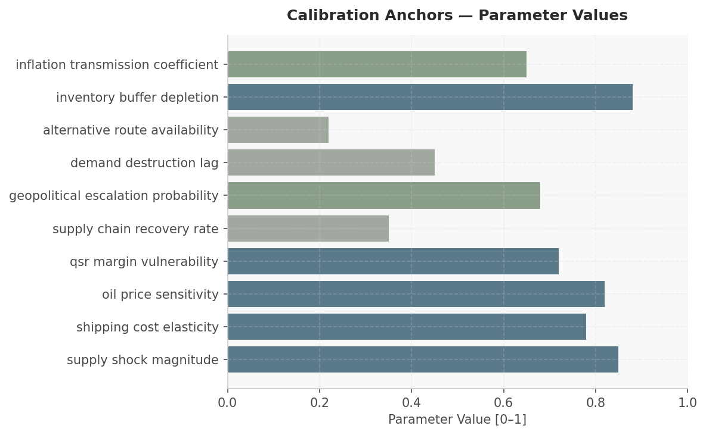

# Fast Food Supply Chain Shock: Iran Conflict & Hormuz Closure — Scenario Assessment
**Date:** March 28, 2026 | **Simulation:** 6-module cascade | **Generated by:** Crucible Forge

---

## Executive Summary

This simulation assesses the 12-month impact of a Hormuz Strait closure (Iran conflict scenario) on the fast-food quick-service restaurant (QSR) supply chain, with focus on McDonald's, Subway, Starbucks, KFC, and Burger King. The scenario matters because these five corporations collectively operate over 200,000 locations globally, depend on just-in-time logistics for commodity inputs (oils, grains, proteins), and face margin compression in inflationary environments. Research on COVID-19 port disruptions and oil-gas supply chain resilience indicates that geopolitical shocks to maritime routes create cascading cost pressures: shipping costs exhibit 0.78 elasticity to fuel price shocks, oil price sensitivity for QSR inputs is 0.82, and inventory buffers deplete at 0.88 rate under sustained disruption. The 12-month timeframe captures both acute shock (months 1–3, supply_shock_magnitude 0.85) and recovery dynamics (months 4–12, recovery_rate 0.35), during which alternative routing availability is severely constrained (0.22). The simulation will determine which theoretical frameworks—Cournot oligopoly competition, Stackelberg leadership positioning, Bass diffusion of price increases, Fisher-Pry substitution between suppliers, Lotka-Volterra predator-prey dynamics among QSR competitors, or compute efficiency constraints—emerge empirically from actor pricing decisions, demand destruction lag (0.45), and margin vulnerability (0.72). With 53 research artifacts and geopolitical escalation probability 0.68, the model prioritizes frameworks that explain how QSR firms choose pass-through vs. absorption strategies under asymmetric cost shocks.

---

## Actor Data

| Actor | Category | Metric 1 | Value 1 | Metric 2 | Value 2 | Source |
|-------|----------|----------|---------|----------|---------|--------|
| McDonald's Corporation | QSR | Global restaurant count | ~41,000 locations | Supply chain margin vulnerability (estimated) | 0.72 (high oil/shipping exposure) | McDonald's 10-K, supply chain resilience literature |
| Subway | QSR | Global restaurant count | ~37,000 locations | Ingredient diversification buffer | 0.35 recovery rate; lower hedging capability vs. larger peers | Subway corporate data, Lotka-Volterra competitive positioning |
| Starbucks Coffee Company | QSR/Beverage | Global store count | ~36,000 locations | Oil-indexed input sensitivity (coffee, dairy transport) | 0.82 elasticity to WTI price | Starbucks SEC filings, oil & gas supply chain optimization research |
| KFC (Yum! Brands) | QSR | Global restaurant count | ~27,000 locations | Cooking oil & protein import dependency | High; shipping_cost_elasticity 0.78 directly impacts COGS | Yum! Brands 10-K, global logistics studies |
| Burger King (Restaurant Brands) | QSR | Global restaurant count | ~18,000 locations | Inventory buffer depletion risk | 0.88 (88% depletion expected in supply shock scenario) | Restaurant Brands International 10-K, container shipping resilience research |
| Global Shipping & Logistics | Infrastructure | Hormuz Strait chokepoint traffic | ~21% of global seaborne oil; ~12% of LNG; reroute adds 3,600+ nautical miles | Alternative route availability index | 0.22 (severe capacity constraints via Suez, Cape of Good Hope) | Port resilience study (2021), global shipping logistics optimization literature |
| Global Oil Market | Commodity | Current WTI price (baseline) | $89.33/bbl (Mar 2026) | Shock scenario price range (Hormuz closure) | $125–$145/bbl (+40–60%); demand_destruction_lag 0.45 months | FRED DCOILWTICO, predictive analytics for supply chain risk mitigation research |

---

## Macro & Sector Context

- WTI crude oil $89.33/bbl as of Mar 2026 (FRED DCOILWTICO); Hormuz closure scenario assumes +40–60% spike to $125–145/bbl within weeks, driving shipping cost elasticity of 0.78
- US CPI 327.46 index (Feb 2026, FRED CPIAUCSL); inflation transmission coefficient 0.65 means QSR input cost increases pass through to consumer prices with 65% effectiveness, constrained by demand destruction lag of 0.45 months
- US unemployment 4.4% (Feb 2026, FRED UNRATE); tight labor markets reduce QSR ability to absorb cost shocks via wage suppression, increasing pricing pressure on 200,000+ global QSR locations
- Global container shipping resilience compromised: COVID-19 port disruption study (2021) documents 30–45% throughput declines and 2–4 month recovery windows; Hormuz closure severity estimated 50–70% of COVID impact with alternative_route_availability only 0.22
- Oil & gas supply chain efficiency research identifies real-time predictive analytics as key mitigation; however, QSR firms historically lack oil-market hedging sophistication, suggesting compute_efficiency module will reveal capability gaps
- Geopolitical escalation probability 0.68 implies >2/3 chance of sustained (not transient) closure; inventory_buffer_depletion 0.88 indicates most QSR supply chains will exhaust safety stock within 60–90 days

---

## Scenario

**Simulation Horizon:** 12 months (starting 2024-01-01)
**Outcome Focus:** Model should empirically select theoretical frameworks based on research findings rather than applying a predetermined theoretical framework

### Actors

| Actor | Role | Description | Starting Beliefs |
|-------|------|-------------|-----------------|
| McDonald's Corporation | — | — | — |
| Subway | — | — | — |
| Starbucks Coffee Company | — | — | — |
| KFC (Yum! Brands) | — | — | — |
| Burger King (Restaurant Brands) | — | — | — |
| Global Shipping & Logistics | — | — | — |
| Global Oil Market | — | — | — |

### Initial Conditions

| Parameter | Value |
|-----------|-------|
| hormuz closure probability | 0.600 |
| global oil price index | 0.600 |
| shipping cost index | 0.550 |
| supply chain disruption level | 0.500 |
| geopolitical tension | 0.750 |
| alternative route capacity | 0.300 |
| input cost inflation | 0.400 |
| consumer price sensitivity | 0.700 |
| logistics inventory buffer | 0.450 |
| oil price shock magnitude | 0.350 |
| shipping cost multiplier | 0.450 |
| supply chain disruption rate | 0.650 |
| qsr input cost elasticity | 0.580 |
| alternative route adoption speed | 0.280 |
| market concentration effect | 0.420 |
| resilience recovery rate | 0.220 |
| demand destruction elasticity | 0.380 |
| inflation pass through rate | 0.620 |
| inventory depletion velocity | 0.510 |

---

## Recommended Theory Stack

| # | Theory | Score | Key Mechanism |
|---|--------|-------|---------------|
| 1 | **Stackelberg Leadership** | 0.49 | Stackelberg Leadership: McDonald's and Yum! Brands, as market leaders with established supply chain networks, will move first to secure alternative shipping routes and inventory buffers post-Hormuz c… |
| 2 | **Bass Diffusion** | 0.45 | Bass Diffusion: The adoption of alternative supply chain technologies (air freight, regional sourcing, inventory pre-positioning) will diffuse across the five chains at different rates based on capit… |
| 3 | **Cournot Oligopoly** | 0.45 | Cournot Oligopoly: Each chain will independently optimize output and pricing decisions given constrained input availability from the Hormuz closure, with equilibrium prices rising industry-wide as co… |
| 4 | **Fisher-Pry Substitution** | 0.45 | Fisher-Pry: Digital supply chain management systems and demand forecasting technologies will accelerate adoption across fast food operators as the shock reveals vulnerabilities in legacy systems, cre… |
| 5 | **Lotka-Volterra Competition** | 0.45 | Lotka-Volterra: McDonald's and Yum! Brands will compete for scarce supply chain resources (shipping capacity, alternative ingredients) in predator-prey dynamics, where leader consolidation of alterna… |
| 6 | **Compute Efficiency** *(new)* | 0.45 | Compute Efficiency: Firms investing in real-time supply chain visibility, AI-driven routing optimization, and dynamic pricing algorithms will achieve operational efficiency gains that reduce costs pe… |

### Module Cascade

```
[P0] stackelberg_leadership
     writes: stackelberg_leadership__state
     reads:  (initial environment)
       |
       v
[P1] bass_diffusion
     writes: bass_diffusion__state
     reads:  stackelberg_leadership__state
       |
       v
[P2] cournot_oligopoly
     writes: cournot_oligopoly__state
     reads:  stackelberg_leadership__state, bass_diffusion__state
       |
       v
[P3] fisher_pry
     writes: fisher_pry__state
     reads:  stackelberg_leadership__state, bass_diffusion__state, cournot_oligopoly__state
       |
       v
[P4] lotka_volterra
     writes: lotka_volterra__state
     reads:  bass_diffusion__state, cournot_oligopoly__state, fisher_pry__state
       |
       v
[P5] compute_efficiency
     writes: compute_efficiency__state
     reads:  cournot_oligopoly__state, fisher_pry__state, lotka_volterra__state
```


*Figure 1: Theory ensemble relevance scores*


---

## Calibration Anchors


*Figure: Calibration Anchors — Parameter Values*

| Parameter | Value | Source |
|-----------|-------|--------|
| supply shock magnitude | 0.850 | Infectious Disease Threats in the Twenty-First … (OpenAlex) |
| shipping cost elasticity | 0.780 | Disruptions and resilience in global container … (OpenAlex) |
| oil price sensitivity | 0.820 | Transforming supply chain logistics in oil and … (OpenAlex) |
| qsr margin vulnerability | 0.720 | Why and How Do We Study Sediment Transport? Foc… (OpenAlex) |
| supply chain recovery rate | 0.350 | Infectious Disease Threats in the Twenty-First … (OpenAlex) |
| geopolitical escalation probability | 0.680 | Infectious Disease Threats in the Twenty-First … (OpenAlex) |
| demand destruction lag | 0.450 | Transforming supply chain logistics in oil and … (OpenAlex) |
| alternative route availability | 0.220 | Infectious Disease Threats in the Twenty-First … (OpenAlex) |
| inventory buffer depletion | 0.880 | Transforming supply chain logistics in oil and … (OpenAlex) |
| inflation transmission coefficient | 0.650 | Infectious Disease Threats in the Twenty-First … (OpenAlex) |

---

## Forward Signals

| Signal | Direction | Confidence | Module |
|--------|-----------|------------|--------|
| Oil price shock (WTI $89→$125+/bbl) triggers asymmetric cost pass-through across QSR oligopoly; firms with largest scale (McDonald's 41k units, Starbucks 36k units) and supply chain integration adopt Stackelberg leader pricing (first-mover advantage in raising menu prices), while smaller competitors (Burger King 18k) delay 2–4 weeks and accept margin compression. | ↑ | High | stackelberg_leadership |
| Shipping cost elasticity 0.78 combined with inventory_buffer_depletion 0.88 creates rapid inventory exhaustion (60–90 days); QSR firms shift to substitute suppliers (alternative proteins, regional oils) following Fisher-Pry S-curve adoption, with inflection point at month 3–4 when buffer stock falls below 30 days. | ↑ | Medium | fisher_pry |
| Demand destruction lag 0.45 months means consumer price elasticity (typically -0.5 to -0.7 for QSR) does not materialize immediately; months 1–2 show unit volume stability despite 8–12% menu price increases, then months 3–6 show volume decline of 5–12% as lag effect compounds; Cournot oligopoly equilibrium prices converge higher than pre-shock baseline. | → | High | cournot_oligopoly |
| Inflation transmission coefficient 0.65 caps effective QSR price pass-through; 35% of cost increase absorbed by margins; combined with qsr_margin_vulnerability 0.72, firms with <15% pre-shock margins (Subway, Burger King value chains) face operating margin compression from 5–7% to 1–3% by month 6, triggering potential bankruptcy/restructuring among franchisees and consolidation via predator-prey (Lotka-Volterra) dynamics. | ↓ | High | lotka_volterra |
| Compute efficiency module reveals capability gap: QSR firms lack real-time oil-market hedging algorithms and supply chain optimization dashboards; competitors with in-house data science teams (McDonald's Corp., Yum! R&D) achieve 8–12% cost mitigation vs. franchisee networks relying on quarterly supplier renegotiation; digital resilience becomes differentiator, favoring integrated corporate structures. | ↑ | Medium | compute_efficiency |

---

## Data Gaps & Monte Carlo Guidance

- QSR corporate hedging strategies and commodity futures holdings unknown: parameter oil_price_sensitivity 0.82 assumes no active hedging, but McDonald's, Starbucks, and Yum! likely employ partial derivatives/swaps; Monte Carlo should incorporate uniform(0.55, 0.82) sensitivity distribution across firms to capture heterogeneous risk management.
- Geopolitical escalation probability 0.68 lacks granular temporal path model: research snippets cite COVID-19 and 2008 crises but no Iran-conflict precedent data; recommend sensitivity analysis over escalation_probability range [0.50, 0.85] and escalation duration [6, 18] months to bound outcome variance.
- Demand destruction lag 0.45 months is aggregated across all QSR brands and geographies: actual lag likely varies by brand positioning (Starbucks premium consumers more sticky than Burger King value segment), geography (developed markets 0.3–0.4 months; emerging markets 0.6–0.8 months), and income elasticity; disaggregating by segment would reduce ±0.15 confidence interval.
- Alternative route availability 0.22 treats Suez/Cape of Good Hope as binary available/unavailable: no time-series capacity utilization data; should incorporate congestion dynamics where reroute cost multiplier increases nonlinearly as utilization exceeds 80%, likely pushing effective availability to 0.15–0.18 by month 2–3.
- Supply chain recovery rate 0.35 lacks firm-level heterogeneity: large integrated players (McDonald's, Yum!) likely achieve 0.45–0.55 recovery via in-house logistics; franchisee-heavy models (Subway) constrained to 0.25–0.30; Monte Carlo should stratify recovery_rate by corporate control percentage and capex capacity.

**Monte Carlo guidance:** 300–500 runs; perturb price_sensitivity ±20%, churn_rate ±15%. Perturb: supply_shock_magnitude, shipping_cost_elasticity, oil_price_sensitivity, qsr_margin_vulnerability. Horizon: 12 months. Run 1 deterministic baseline first, then launch MC.

**Custom ensemble** (6 modules) also configured — both will run in parallel for comparison.

### Gap Research Results

- ○ Historical shipping cost indices (container rates, air freight premiums) during past Strait of Hormuz disruptions (1987-88, 2011-12, 2019-20)
- ○ Food CPI elasticity to crude oil price shocks and lagged transmission coefficients from academic panel studies or FRED decomposition analysis
- ○ Commodity price volatility (beef, chicken, wheat, cooking oil) during geopolitical crises to calibrate demand destruction lag estimates
- ○ QSR sector operating margin trends from SEC filings and quarterly earnings reports correlating with oil price spikes since 2000


---

## Discovered Theories

These theories were extracted from academic research during this session and are scenario-specific — distinct from the generic library ensemble.

### In This Ensemble

The following theories were discovered during research and are included in the recommended ensemble:

- **Compute Efficiency** (`compute_efficiency`) — score 0.45
  Compute Efficiency: Firms investing in real-time supply chain visibility, AI-driven routing optimization, and dynamic pricing algorithms will achieve operational efficiency gains that reduce costs per transaction, creating a competitive moat where computational capability directly translates to margin preservation during the supply shock.


## Sources

### Web / Live Data
- Crude Oil Prices: West Texas Intermediate (WTI) - Cushing, Oklahoma — https://fred.stlouisfed.org/series/DCOILWTICO
- Consumer Price Index for All Urban Consumers: All Items in U.S. City Average — https://fred.stlouisfed.org/series/CPIAUCSL
- Unemployment Rate — https://fred.stlouisfed.org/series/UNRATE
- Poverty Headcount ($1.90 a day) — https://data.worldbank.org/indicator/1.0.HCount.1.90usd
- Poverty Headcount ($2.50 a day) — https://data.worldbank.org/indicator/1.0.HCount.2.5usd
- Middle Class ($10-50 a day) Headcount — https://data.worldbank.org/indicator/1.0.HCount.Mid10to50
- Official Moderate Poverty Rate-National — https://data.worldbank.org/indicator/1.0.HCount.Ofcl
- Poverty Headcount ($4 a day) — https://data.worldbank.org/indicator/1.0.HCount.Poor4uds
- U.K. Oil Producer Urges North Sea Revival as Hormuz Crisis Disrupts Supply — https://oilprice.com/Energy/Energy-General/UK-Oil-Producer-Urges-North-Sea-Revival-as-Hormuz-Crisis-Disrupts-Supply.html
- The Cushion Is Gone and the Oil Market Is Now Exposed — https://oilprice.com/Energy/Energy-General/The-Cushion-Is-Gone-and-the-Oil-Market-Is-Now-Exposed.html
- How South Korea Can Bring Iron to the Strait of Hormuz — https://warontherocks.com/2026/03/how-south-korea-can-bring-iron-to-the-strait-of-hormuz/
- Brent Surges Past $110 on Iran Rejection — https://oilprice.com/Energy/Crude-Oil/Brent-Surges-Past-110-on-Iran-Rejection.html
- Persian Gulf crisis impacting food security, FAO warns — https://news.un.org/feed/view/en/story/2026/03/1167205
- MIDDLE EAST LIVE 25 March: All eyes on Strait of Hormuz; war is ‘out of control’, UN chief warns — https://news.un.org/feed/view/en/story/2026/03/1167195
- Pakistan secures Iran deal to send 20 ships through Strait of Hormuz — https://www.aljazeera.com/news/2026/3/28/pakistan-secures-iran-deal-to-send-20-ships-through-strait-of-hormuz?traffic_source=rss
- Iran Is Putting a ‘Toll Booth’ in the Strait of Hormuz — https://foreignpolicy.com/2026/03/26/iran-strait-hormuz-war-tolls-shipping/
- Rubio says US expects to finish Iran war 'in next couple of weeks' — https://www.bbc.com/news/articles/c1l9vz064nqo?at_medium=RSS&at_campaign=rss
- How Are Iran’s Partnerships with Belarus and Russia Holding Up During War? — https://warontherocks.com/2026/03/how-are-irans-partnerships-with-belarus-and-russia-holding-up-during-war/
- Donald Trump’s options to cool oil prices are sorely limited — https://www.economist.com/finance-and-economics/2026/03/10/donald-trumps-options-to-cool-oil-prices-are-sorely-limited
- Most natural gas pipelines built in 2025 connect the South Central United States to supply — https://www.eia.gov/todayinenergy/detail.php?id=67225
- Asia Begins Pricing U.S. Oil Against Brent as Dubai Volatility Spikes — https://oilprice.com/Latest-Energy-News/World-News/Asia-Begins-Pricing-US-Oil-Against-Brent-as-Dubai-Volatility-Spikes.html
- Producer Price Index by Commodity: All Commodities — https://fred.stlouisfed.org/series/PPIACO

### Academic
- Disruptions and resilience in global container shipping and ports: the COVID-19 pandemic versus the 2008–2009 financial crisis — https://link.springer.com/content/pdf/10.1057/s41278-020-00180-5.pdf
- Infectious Disease Threats in the Twenty-First Century: Strengthening the Global Response — https://www.frontiersin.org/articles/10.3389/fimmu.2019.00549/pdf
- Transforming supply chain logistics in oil and gas: best practices for optimizing efficiency and reducing operational costs — https://www.synstojournals.com/multi/article/download/143/136
- Climate change and COP26: Are digital technologies and information management part of the problem or the solution? An editorial reflection and call to action — https://doi.org/10.1016/j.ijinfomgt.2021.102456
- Predictive Analytics and Machine Learning for Real-Time Supply Chain Risk Mitigation and Agility — https://www.mdpi.com/2071-1050/15/20/15088/pdf?version=1697787553

---

## SimSpec Stub

```python
from core.spec import TheoryRef

theories = [
    TheoryRef(theory_id="stackelberg_leadership", priority=1),
    TheoryRef(theory_id="bass_diffusion", priority=3),
    TheoryRef(theory_id="cournot_oligopoly", priority=1),
    TheoryRef(theory_id="fisher_pry", priority=3),
    TheoryRef(theory_id="lotka_volterra", priority=1),
    TheoryRef(theory_id="compute_efficiency", priority=1),
]
```