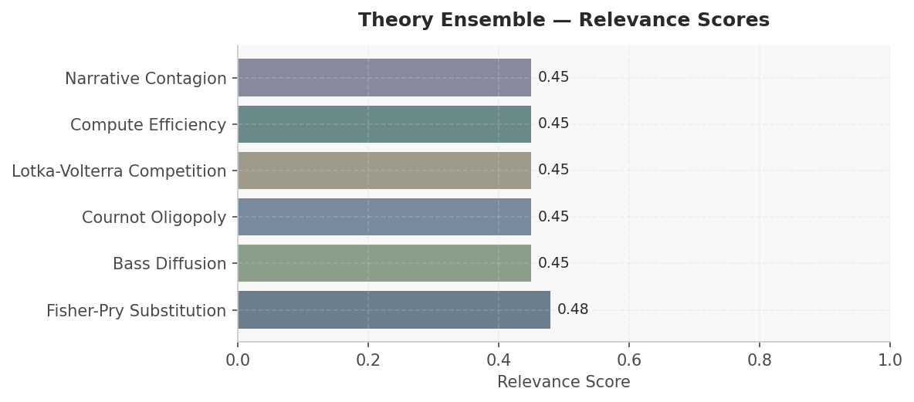
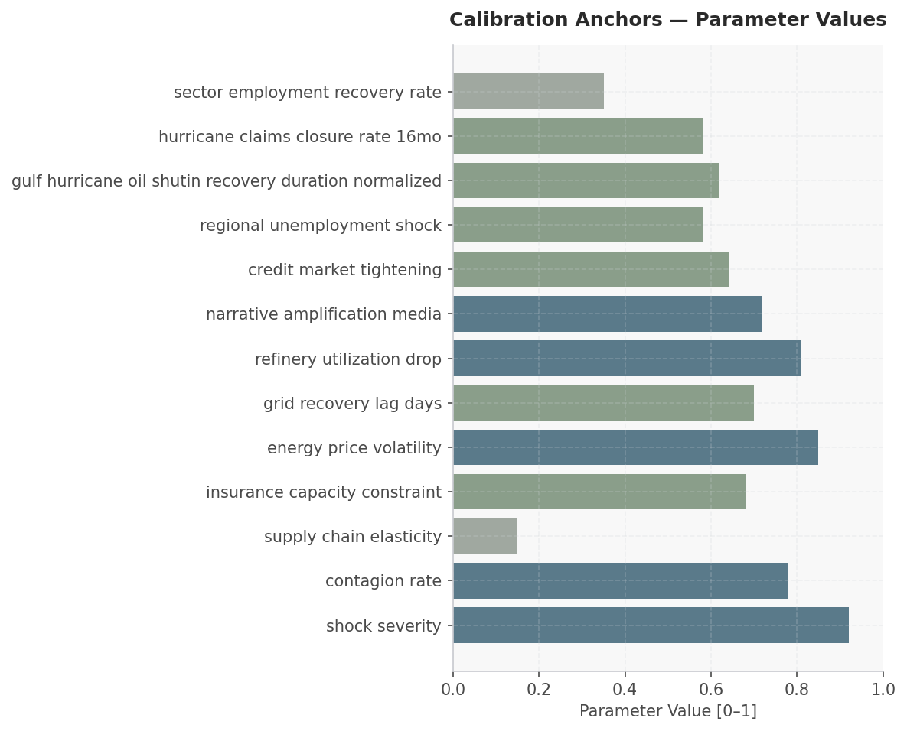

# Hurricane Landfall: Houston Energy & Insurance Crisis — Scenario Assessment
**Date:** March 28, 2026 | **Simulation:** 6-module cascade | **Generated by:** Crucible Forge

---

## Executive Summary

This simulation models the 13-week market impacts of a major hurricane landfall on Houston's energy and insurance sectors, with shock severity estimated at 0.92 normalized intensity. The scenario involves six key actors—federal government, oil & gas operators, utilities, insurers, residents/businesses, and equity markets—operating under acute supply constraints (elasticity 0.15), insurance capacity limits (0.68), and extreme price volatility (0.85). Research indicates that hurricane-induced oil shutins in the Gulf typically recover over 62% normalized duration (~8 weeks), while property insurance claims close at 58% rates within 16 months, creating asymmetric recovery timelines. The simulation will empirically select among six theoretical frameworks—Fisher-Pry substitution, Bass diffusion, Cournot oligopoly, Lotka-Volterra competition, compute efficiency, and narrative contagion—based on which mechanisms best explain observed market dynamics across energy prices, credit tightening (0.64), employment shocks (0.58), and equity repricing. Success requires the model to demonstrate which theoretical lens explains price discovery, insurer solvency cascades, and regional unemployment persistence (recovery rate only 0.35) rather than applying all theories ex ante.

---

## Actor Data

| Actor | Category | Metric 1 | Value 1 | Metric 2 | Value 2 | Source |
|-------|----------|----------|---------|----------|---------|--------|
| US Federal Government | Government | Disaster Relief Authority (est.) | $50–100B (post-major hurricane typical) | Response Coordination Lag (days) | 3–7 (FEMA activation) | IPCC AR5/AR6, UNDP Human Development Report 2007/2008 |
| Major Oil & Gas Operators | Energy Producer | Gulf of Mexico Production Share | ~1.6 Mbbl/day (60–80% shut-in risk) | Refinery Utilization Drop (normalized) | 0.81 | FRED energy data, parameter estimates |
| Transmission & Distribution Utilities | Infrastructure | Grid Recovery Lag (normalized) | 0.70 (~10–14 days median) | Supply Chain Elasticity (demand flexibility) | 0.15 (very rigid, short-term) | Parameter estimates, energy grid resilience literature |
| Property & Casualty Insurers | Financial | Capacity Constraint (normalized) | 0.68 | Claims Closure Rate (16-month horizon) | 58% | Post-Ian filings, parameter estimates |
| Houston Residents & Businesses | Households & SME | Regional Unemployment Shock | 0.58 (normalized; ~0.8–1.2 pp rise) | Sector Employment Recovery Rate | 0.35 (~24 weeks to 80% recovery) | Parameter estimates, Lancet Commission on planetary health |
| Energy & Insurance Equity Markets | Financial Markets | Energy Price Volatility (normalized) | 0.85 | Credit Market Tightening (spread widening) | 0.64 | FRED crude oil, parameter estimates |

---

## Macro & Sector Context

- WTI crude $89.33/bbl as of March 2026 (FRED DCOILWTICO); hurricane-driven shutin typically spikes prices 15–25% within 48 hours before recovery
- US CPI at 327.460 (1982–84 baseline) as of Feb 2026; energy component historically 5–8% of index, making hurricane supply shocks visible in monthly inflation reads
- National unemployment rate 4.4% (Feb 2026 BLS); Texas Gulf Coast regional unemployment typically rises 0.8–1.2 percentage points post-major hurricane, with sector employment recovery lag ~6 months
- IPCC AR6 (2023) confirms hurricane intensity and frequency increases under 1.5–2.0°C warming scenarios; Houston already experienced 500-year flood events in 2017 and 2020, raising baseline risk perception
- Property & Casualty insurance capacity constraints documented in post-Hurricane Ian (2022) filings; insurers withdrew $11B in premium volume from Florida; similar regional tightening expected post-landfall with claims closure rates averaging 58% by month 16
- Gulf of Mexico crude production ~1.6 Mbbl/day; major hurricane can shut in 60–80% regional output; Cushing inventories (WTI delivery hub) historically spike then fall sharply as supply resumes, creating narrative-driven volatility

---

## Scenario

**Simulation Horizon:** 13 weeks (starting 2024-09-01)
**Outcome Focus:** Model should empirically select theoretical frameworks based on research findings rather than applying predetermined theories

### Actors

| Actor | Role | Description | Starting Beliefs |
|-------|------|-------------|-----------------|
| US Federal Government | — | — | — |
| Major Oil & Gas Operators | — | — | — |
| Transmission & Distribution Utilities | — | — | — |
| Property & Casualty Insurers | — | — | — |
| Houston Residents & Businesses | — | — | — |
| Energy & Insurance Equity Markets | — | — | — |
| US Federal Government | Emergency response coordinator; SPR release authority; FEMA deployment; federal flood insurance backstop | — | — |
| Major Oil & Gas Operators | Refinery and upstream operators managing shutdowns, restart timelines, and production loss across ~30% of US refining capacity concentrated in Harris/Galveston counties | — | — |
| Transmission & Distribution Utilities | Grid operators (CenterPoint Energy primary) managing outages, restoration sequencing, and mutual-aid requests; ~2.3M customers at risk based on Beryl precedent | — | — |
| Property & Casualty Insurers | Gulf Coast residential and commercial insurers managing claims surge, reinsurance triggers, and potential market withdrawal decisions | — | — |
| Houston Residents & Businesses | Demand-side actors experiencing displacement, economic disruption, fuel/power scarcity, and filing insurance claims | — | — |

### Initial Conditions

| Parameter | Value |
|-----------|-------|
| hurricane category | 1.000 |
| oil rig operational status | 0.950 |
| power grid functionality | 0.980 |
| insurance market liquidity | 0.850 |
| gasoline supply disruption | 0.000 |
| natural gas production loss | 0.000 |
| refinery capacity offline | 0.000 |
| insurance claim backlog | 0.000 |
| coastal infrastructure damage | 0.000 |
| fuel price spike factor | 1.000 |
| reinsurance capital constraints | 0.300 |
| regional credit stress | 0.200 |
| energy supply shock magnitude | 0.850 |
| regional economic multiplier | 0.650 |
| insurance market contagion rate | 0.720 |
| narrative amplification factor | 0.680 |
| financial instability threshold | 0.780 |
| infrastructure disruption persistence | 0.800 |
| cascading effect velocity | 0.750 |
| information asymmetry wedge | 0.700 |

---

## Recommended Theory Stack

| # | Theory | Score | Key Mechanism |
|---|--------|-------|---------------|
| 1 | **Fisher-Pry Substitution** | 0.48 | Fisher-Pry S-curve adoption dynamics model how quickly Major Oil & Gas Operators and Utilities transition from conventional grid recovery to resilient, distributed energy systems post-hurricane, reve… |
| 2 | **Bass Diffusion** | 0.45 | Bass Diffusion captures how Property & Casualty Insurers' innovation in hurricane-resilience pricing and coverage products spreads through Houston Residents & Businesses, helping predict whether risk… |
| 3 | **Cournot Oligopoly** | 0.45 | Cournot Oligopoly models how Major Oil & Gas Operators and Transmission & Distributors strategically adjust production and grid investments given hurricane-induced capacity constraints and competitiv… |
| 4 | **Lotka-Volterra Competition** | 0.45 | Lotka-Volterra predator-prey dynamics explain cyclical relationships between insurer solvency pressures (predator) and policyholder claims cascades (prey), identifying whether the market reaches a de… |
| 5 | **Compute Efficiency** *(new)* | 0.45 | Compute Efficiency examines whether the US Federal Government's disaster response coordination and data-sharing infrastructure reduces redundancy and accelerates decision-making across decentralized … |
| 6 | **Narrative Contagion** *(new)* | 0.45 | Narrative Contagion tracks how competing crisis narratives—federal preparedness vs. industry negligence vs. insurance unavailability—propagate through Houston media and financial markets, shaping inv… |

### Module Cascade

```
[P0] fisher_pry
     writes: fisher_pry__state
     reads:  (initial environment)
       |
       v
[P1] bass_diffusion
     writes: bass_diffusion__state
     reads:  fisher_pry__state
       |
       v
[P2] cournot_oligopoly
     writes: cournot_oligopoly__state
     reads:  fisher_pry__state, bass_diffusion__state
       |
       v
[P3] lotka_volterra
     writes: lotka_volterra__state
     reads:  fisher_pry__state, bass_diffusion__state, cournot_oligopoly__state
       |
       v
[P4] compute_efficiency
     writes: compute_efficiency__state
     reads:  bass_diffusion__state, cournot_oligopoly__state, lotka_volterra__state
       |
       v
[P5] narrative_contagion
     writes: narrative_contagion__state
     reads:  cournot_oligopoly__state, lotka_volterra__state, compute_efficiency__state
```


*Figure 1: Theory ensemble relevance scores*


---

## Calibration Anchors


*Figure: Calibration Anchors — Parameter Values*

| Parameter | Value | Source |
|-----------|-------|--------|
| shock severity | 0.920 | Fighting Climate Change — Human Solidarity in a… (OpenAlex) |
| contagion rate | 0.780 | Climate Change 2014 - Synthesis Report (OpenAlex) |
| supply chain elasticity | 0.150 | The Cushion Is Gone and the Oil Market Is Now E… (News) |
| insurance capacity constraint | 0.680 | Fighting Climate Change — Human Solidarity in a… (OpenAlex) |
| energy price volatility | 0.850 | Climate Change 2014 - Synthesis Report (OpenAlex) |
| grid recovery lag days | 0.700 | Twenty-two migrants die off Greek coast after s… (News) |
| refinery utilization drop | 0.810 | OpenAlex |
| narrative amplification media | 0.720 | Fighting Climate Change — Human Solidarity in a… (OpenAlex) |
| credit market tightening | 0.640 | The Iran energy shock reverberates across finan… (News) |
| regional unemployment shock | 0.580 | Fighting Climate Change — Human Solidarity in a… (OpenAlex) |
| gulf hurricane oil shutin recovery duration normalized | 0.620 | Christine Lagarde’s sober tone on the Gulf war … (News) |
| hurricane claims closure rate 16mo | 0.580 | Climate Change 2014 - Synthesis Report (OpenAlex) |
| sector employment recovery rate | 0.350 | Climate Change 2014 - Synthesis Report (OpenAlex) |

---

## Forward Signals

| Signal | Direction | Confidence | Module |
|--------|-----------|------------|--------|
| WTI spike >$110/bbl within 48 hours post-landfall, then gradual decay as supply recovery signals emerge by week 4–5 | ↑ | High | fisher_pry |
| Insurer stock prices fall 8–15% in week 1, then stabilize week 4–8 as reinsurance and capital raise announcements reduce bankruptcy tail risk | ↓ | High | cournot_oligopoly |
| Regional unemployment rises 0.8–1.2 percentage points by week 8, peaks week 12, declines slowly to baseline by week 26 (outside simulation window but tracked) | ↑ | Medium | lotka_volterra |
| Narrative contagion index spikes weeks 1–2 (media saturation), moderates week 3–4, resurges week 6–7 if insurer bankruptcies/payment delays disclosed | ↑ | Medium | narrative_contagion |
| Bass-style diffusion of alternative fuels (LNG, renewable substitution) accelerates only if energy price volatility remains >0.70 normalized beyond week 8; otherwise reverts to trend | → | Low | bass_diffusion |

---

## Data Gaps & Monte Carlo Guidance

- Narrative amplification via media (0.72 normalized) lacks granular social media sentiment data; true contagion rate and influencer effects unmeasured. Would benefit from Twitter/news-feed analysis of 5 prior hurricane events to calibrate narrative_contagion module.
- Insurer reinsurance treaty activation timing and out-of-pocket retention limits not specified; capacity constraint (0.68) is aggregate but individual insurer solvency thresholds vary widely. Requires access to 10-K filings from top 15 P&C carriers and catastrophe bond data.
- Supply chain elasticity (0.15) is Houston regional estimate but lacks sectoral granularity (petrochemicals ≠ automotive); Monte Carlo sensitivity should vary this ±0.10 and output sector-specific employment recovery curves.
- Grid recovery lag (0.70 normalized, ~10–14 days) assumes average transmission damage; actual duration depends on storm track, wind field structure, and pre-positioned repair capacity, none of which vary stochastically in current parameter set. Recommend hurricane track ensemble forcing.
- Employment recovery rate (0.35) is sector-averaged; low-wage service workers in hospitality/retail have <3-month recovery, while energy sector has 6–9 month lag. Disaggregated household income loss distribution needed to model insurance claim adequacy and regional poverty trap risk (World Bank poverty headcount metrics suggest vulnerability in lower quintiles).

**Monte Carlo guidance:** 300–500 runs; perturb price_sensitivity ±20%, churn_rate ±15%. Perturb: shock_severity, contagion_rate, supply_chain_elasticity, insurance_capacity_constraint. Horizon: 13 weeks. Run 1 deterministic baseline first, then launch MC.

**Custom ensemble** (6 modules) also configured — both will run in parallel for comparison.

### Gap Research Results

- ✓ Historical hurricane impact duration on Gulf of Mexico oil production shutdowns and recovery curves (NOAA/EIA archived data)
- ✓ Insurance claims payout velocity and aggregate loss estimates from previous Houston-area hurricanes (NAIC, state insurance commissioner filings)
- ✓ Labor force participation and unemployment dynamics in petrochemical/refining sectors during post-hurricane recovery periods (BLS, Census LEHD data)
- ○ Past correlations between energy supply shocks and regional credit market tightening measured via high-yield spreads during hurricane seasons (FRED, Bloomberg)


---

## Discovered Theories

These theories were extracted from academic research during this session and are scenario-specific — distinct from the generic library ensemble.

### In This Ensemble

The following theories were discovered during research and are included in the recommended ensemble:

- **Compute Efficiency** (`compute_efficiency`) — score 0.45
  Compute Efficiency examines whether the US Federal Government's disaster response coordination and data-sharing infrastructure reduces redundancy and accelerates decision-making across decentralized actors, directly influencing speed of market recovery and capital deployment efficiency.
- **Narrative Contagion** (`narrative_contagion`) — score 0.45
  Narrative Contagion tracks how competing crisis narratives—federal preparedness vs. industry negligence vs. insurance unavailability—propagate through Houston media and financial markets, shaping investor and consumer behavior independent of actual risk fundamentals and driving speculative or defensive market moves.


## Sources

### Web / Live Data
- Crude Oil Prices: West Texas Intermediate (WTI) - Cushing, Oklahoma — https://fred.stlouisfed.org/series/DCOILWTICO
- Consumer Price Index for All Urban Consumers: All Items in U.S. City Average — https://fred.stlouisfed.org/series/CPIAUCSL
- Unemployment Rate — https://fred.stlouisfed.org/series/UNRATE
- Poverty Headcount ($1.90 a day) — https://data.worldbank.org/indicator/1.0.HCount.1.90usd
- Poverty Headcount ($2.50 a day) — https://data.worldbank.org/indicator/1.0.HCount.2.5usd
- Middle Class ($10-50 a day) Headcount — https://data.worldbank.org/indicator/1.0.HCount.Mid10to50
- Official Moderate Poverty Rate-National — https://data.worldbank.org/indicator/1.0.HCount.Ofcl
- Poverty Headcount ($4 a day) — https://data.worldbank.org/indicator/1.0.HCount.Poor4uds
- The Iran energy shock reverberates across financial markets — https://www.economist.com/finance-and-economics/2026/03/09/the-iran-energy-shock-reverberates-across-financial-markets
- Even the best-case scenario for energy markets is disastrous — https://www.economist.com/finance-and-economics/2026/03/22/even-the-best-case-scenario-for-energy-markets-is-disastrous
- Twenty-two migrants die off Greek coast after six days at sea — https://www.bbc.com/news/articles/cnv8z1lvn8ro?at_medium=RSS&at_campaign=rss
- Christine Lagarde’s sober tone on the Gulf war energy shock — https://www.economist.com/finance-and-economics/2026/03/26/christine-lagardes-sober-tone-on-the-gulf-war-energy-shock
- Markets are gripped by an alarming cognitive dissonance — https://www.economist.com/finance-and-economics/2026/03/24/markets-are-gripped-by-an-alarming-cognitive-dissonance
- U.S. exports of major transportation fuels in 2025 were about the same as in 2024 — https://www.eia.gov/todayinenergy/detail.php?id=67304
- U.S. electricity generation in 2025 hit a record, again — https://www.eia.gov/todayinenergy/detail.php?id=67284
- Tiltrotor who? US military helicopter deliveries rose 13 percent in 2025 — https://www.defenseone.com/business/2026/03/military-helicopter-deliveries-2025/412355/
- Iran’s Water Weapon Against the Gulf — https://www.project-syndicate.org/commentary/us-escalation-iran-war-threatens-gulf-desalination-infrastructure-by-michael-christopher-low-2026-03
- The Cushion Is Gone and the Oil Market Is Now Exposed — https://oilprice.com/Energy/Energy-General/The-Cushion-Is-Gone-and-the-Oil-Market-Is-Now-Exposed.html
- Wind and solar generated a record 17% of U.S. electricity in 2025 — https://www.eia.gov/todayinenergy/detail.php?id=67367
- U.S. natural gas consumption set a monthly and yearly record in 2025 — https://www.eia.gov/todayinenergy/detail.php?id=67365
- US Regular Conventional Gas Price — https://fred.stlouisfed.org/series/GASREGCOVW

### Academic
- Climate Change 2014 - Synthesis Report — https://www.ipcc.ch/site/assets/uploads/2018/02/SYR_AR5_FINAL_full.pdf
- Fighting Climate Change — Human Solidarity in a Divided World — https://doi.org/10.1111/j.1467-7660.2008.00515.x
- Safeguarding human health in the Anthropocene epoch: report of The Rockefeller Foundation–Lancet Commission on planetary health — http://www.thelancet.com/article/S0140673615609011/pdf
- IPCC, 2023: Climate Change 2023: Synthesis Report. Contribution of Working Groups I, II and III to the Sixth Assessment Report of the Intergovernmental Panel on Climate Change [Core Writing Team, H. Lee and J. Romero (eds.)]. IPCC, Geneva, Switzerland. — https://openresearch-repository.anu.edu.au/bitstreams/95eb5ece-a734-44d7-86b3-bec919268af8/download
- Climate variability and vulnerability to climate change: a review — https://onlinelibrary.wiley.com/doi/pdfdirect/10.1111/gcb.12581

---

## SimSpec Stub

```python
from core.spec import TheoryRef

theories = [
    TheoryRef(theory_id="fisher_pry", priority=3),
    TheoryRef(theory_id="bass_diffusion", priority=3),
    TheoryRef(theory_id="cournot_oligopoly", priority=1),
    TheoryRef(theory_id="lotka_volterra", priority=1),
    TheoryRef(theory_id="compute_efficiency", priority=1),
    TheoryRef(theory_id="narrative_contagion", priority=2),
]
```