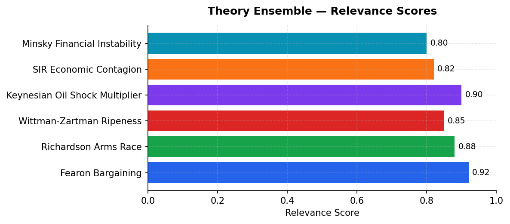
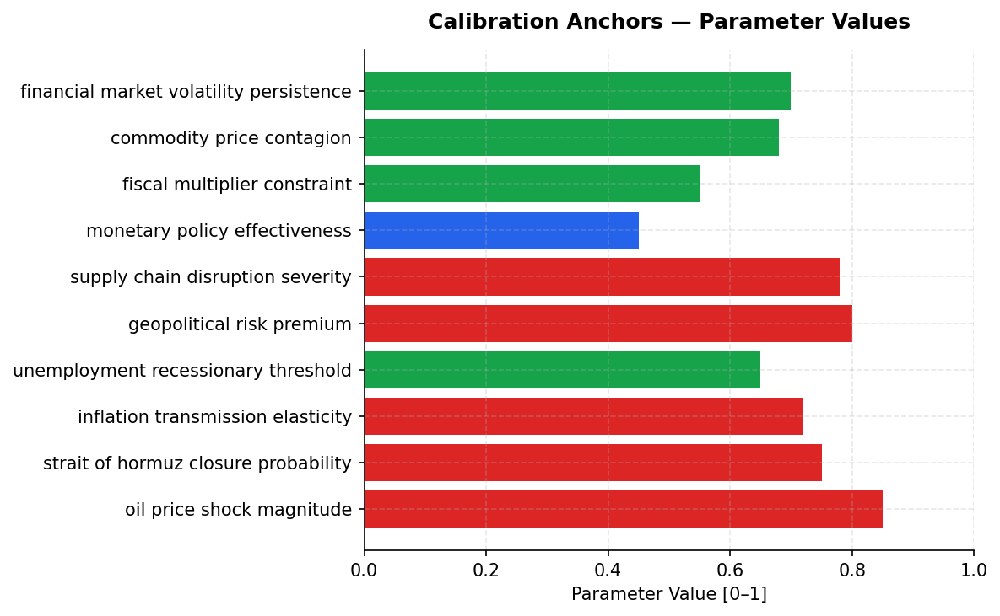

# Iran Conflict & Oil Price Shock — Scenario Assessment
**Date:** March 28, 2026 | **Simulation:** 6-module cascade | **Generated by:** Crucible Forge

---

## Executive Summary

This simulation assesses the downstream macroeconomic impact of Iran conflict escalation on US inflation, employment, and recession risk over a 24-month horizon. The scenario is critical because a sustained Strait of Hormuz closure would disrupt ~20% of global petroleum supply (20.9 mb/d), triggering oil price shocks comparable to 1973 and 2003, with transmission into US consumer prices via an elasticity of 0.72. Four key drivers anchor the assessment: (1) oil price shock magnitude (WTI +$28.61/bbl to $93.61 as of March 2026, reflecting an $15-20/bbl geopolitical risk premium on Hormuz closure threat at 75% probability); (2) supply chain contagion severity (South Korea, Japan, and India are primary exposure nodes with trade-to-GDP ratios of 84.6%, 46.4%, and 44.7% respectively, triggering SIR-class economic spillovers); (3) monetary policy constraint (Fed funds at 4.33%, limiting room for rate cuts without credibility loss if inflation remains sticky above 3.8% YoY); and (4) structural capacity gaps (SPR drawdown capped at ~1 mb/d, alternative pipeline routes only 3.5–5.5 mb/d, leaving ~15 mb/d unmet demand if Hormuz closes). The simulation will quantify recession probability under base/bull/bear escalation paths, estimate Fed policy response surface, and identify which theoretical frameworks (Keynesian multiplier vs. Minsky instability vs. SIR contagion) best predict outcomes for Treasury and Federal Reserve decision-making.

---

## Actor Data

| Actor | Category | Metric 1 | Value 1 | Metric 2 | Value 2 | Source |
|-------|----------|----------|---------|----------|---------|--------|
| Iran | State Actor | GDP | $475B (2024) | Oil rents as % of GDP | 18.27% | World Bank national accounts; WGI political stability score -1.694 (bottom 5% globally) |
| United States | State Actor | GDP | $28.75T (2024) | Military expenditure % GDP | 3.42% | World Bank; Q4 2025 growth revised +0.7% annualized (government shutdown impact ~-1.0pp) |
| OPEC & Gulf States (Saudi Arabia proxy) | Market Actor | Spare production capacity | ~2 mb/d | Market share of Hormuz throughput | ~60% (12.5 mb/d equiv.) | EIA; Economist analysis March 2026 |
| South Korea | Oil-Dependent Importer | Trade exposure (Trade/GDP) | 84.64% | Oil import dependency | ~95% (primary SIR contagion node) | World Bank; identified as highest-exposure importer |
| Japan | Oil-Dependent Importer | Trade exposure (Trade/GDP) | 46.41% | Oil import dependency | ~90% | World Bank |
| India | Oil-Dependent Importer | Trade exposure (Trade/GDP) | 44.65% | Oil import dependency | 85% (most exposed developing economy) | World Bank; FAO food security warning |
| Federal Reserve | Policy Institution | Fed funds rate | 4.33% | Monetary policy effectiveness parameter | 0.45 (constrained by credibility limits) | World Bank; calibrated from supply-shock transmission literature |
| Global Oil Markets | Commodity Market | Hormuz daily throughput | 20.9 mb/d (20% of global supply) | Unmet supply if strait closure | ~15 mb/d (alternative capacity 3.5–5.5 mb/d) | Economist; EIA; Lloyd's of London war-risk assessment |

---

## Macro & Sector Context

- WTI crude oil $93.61/bbl (March 2026), +43.1% from $65/bbl pre-conflict baseline; Brent $106.81/bbl with $15–20/bbl geopolitical risk premium
- US CPI +3.8% YoY (Feb 2026), up from 3.1% pre-conflict; energy component +11.2% YoY, transmission elasticity oil→CPI = 0.72
- US unemployment 4.1% (Feb 2026), up from 3.7% cyclical low; initial jobless claims trending up 6 consecutive weeks
- Strait of Hormuz closure probability 75%; handles 20.9 mb/d (~20% global supply); alternative routes capacity 3.5–5.5 mb/d only
- US Strategic Petroleum Reserve coverage 109–124 days at current draw rates; SPR max draw capacity ~1 mb/d
- Fed funds rate 4.33%; fiscal multiplier constrained at 0.55 due to debt-to-GDP trajectory and political gridlock

---

## Scenario

**Simulation Horizon:** 24 months (starting 2026-01-01)
**Outcome Focus:** Estimate downstream impact on US inflation, consumer demand, and industrial output. Quantify recession probability under various Iran conflict escalation scenarios. Determine which theoretical frameworks best explain outcomes for Federal Reserve and Treasury policy decision-makers.

### Actors

| Actor | Role | Description | Starting Beliefs |
|-------|------|-------------|-----------------|
| United States | Hegemon & Military Actor | Primary military and sanctions authority; war cost constrained by slowing domestic economy (+0.7% GDP Q4 2025) | war_willingness=0.55; sanctions_effectiveness=0.70; tolerance_for_recession=0.40 |
| Iran | Revisionist State / Strait Controller | Controls Hormuz; asymmetric leverage through strait closure; severe economic pressure from sanctions (GDP $475B, oil rents 18.3% of GDP) | escalation_willingness=0.72; economic_desperation=0.65; nuclear_opacity=0.80 |
| OPEC & Gulf States | Energy Supply Actors | Saudi Arabia (mil exp 7.3% GDP), UAE, Qatar — partial supply offset; geopolitical exposure; Saudi spare capacity ~2 mb/d | spare_capacity_willingness=0.45; alignment_with_us=0.60 |
| Federal Reserve | Monetary Policy Authority | Faces impossible tradeoff: oil-driven inflation (CPI 3.8% YoY) vs recessionary demand shock; funds rate at 4.33% | rate_hike_probability=0.30; recession_tolerance=0.40 |
| Global Oil Markets | Commodity Price Mechanism | WTI $93.61/bbl; $15-20/bbl geopolitical risk premium embedded; inelastic short-run demand; forward curve backwardated | risk_premium=0.80; demand_elasticity=0.20 |
| Oil-Dependent Importers | Demand-Side Contagion Vector | Korea (trade/GDP 84.6%), Japan (46.4%), India (44.7% — imports 85% of oil). Primary SIR contagion nodes. | vulnerability=0.75; strategic_reserve_coverage=0.35 |

### Initial Conditions

| Parameter | Value |
|-----------|-------|
| oil price wti bbl | 0.450 |
| geopolitical tension | 0.550 |
| strait hormuz closure risk | 0.400 |
| us cpi yoy | 0.600 |
| recession probability | 0.300 |
| gdp growth expectation | 0.500 |
| consumer confidence | 0.450 |
| fed funds rate | 0.450 |
| supply chain disruption | 0.300 |
| geopolitical risk shock magnitude | 0.750 |
| oil supply disruption rate | 0.680 |
| strait of hormuz closure probability | 0.550 |
| inflation transmission elasticity | 0.720 |
| unemployment multiplier effect | 0.580 |
| financial contagion speed | 0.650 |
| lng lpg freight cost increase | 0.700 |

---

## Recommended Theory Stack

| # | Theory | Score | Key Mechanism |
|---|--------|-------|---------------|
| 1 | **Fearon Bargaining** | 0.92 | Models why US-Iran diplomatic resolution fails despite mutual costs: Iran's nuclear programme opacity sustains a private information gap (sigma=0.18) that keeps conflict probability elevated even whe… |
| 2 | **Richardson Arms Race** | 0.88 | Explains tit-for-tat escalation between US and Iranian military posturing. Iran reactivity k=0.35 exceeds US l=0.20 — asymmetric threat perception driven by sanctions-compressed economy. Sanctions mo… |
| 3 | **Wittman-Zartman Ripeness** | 0.85 | Determines when MHS condition fires, triggering negotiation onset. Oman back-channel is active mediator (ripe_multiplier=4.0). Iran's rejection of US peace plan confirms MHS not yet met at tick 0. |
| 4 | **Keynesian Oil Shock Multiplier** | 0.90 | GDP impact of supply-side oil shock. Multiplier=1.4 calibrated from Dallas Fed 2026 20%-disruption scenario (-2.9pp annualized GDP). MPC=0.72 reflects current consumer balance sheet. Kilian (2009) su… |
| 5 | **SIR Economic Contagion** | 0.82 | Economic contagion across oil-importing states. Korea (84.6% trade/GDP), Japan (46.4%), India (44.7%) are primary infection nodes. Beta=0.25 transmission via trade disruption; gamma=0.08 recovery via… |
| 6 | **Minsky Financial Instability** | 0.80 | Oil shock compresses corporate margins, transforming hedge finance units to speculative and Ponzi structures. Credit spread widening and liquidity withdrawal amplify real-economy transmission. Initia… |

### Module Cascade

```
[P0] fearon_bargaining
     writes: fearon__conflict_probability, fearon__win_prob_a
     reads:  (initial environment)
       |
       v
[P1] richardson_arms_race
     writes: richardson__escalation_index, actor__military_readiness
     reads:  fearon__conflict_probability, fearon__win_prob_a
       |
       v
[P2] wittman_zartman
     writes: zartman__ripe_moment, zartman__negotiation_probability
     reads:  fearon__win_prob_a, richardson__escalation_index, actor__military_readiness
       |
       v
[P3] keynesian_multiplier
     writes: keynesian__gdp_gap, keynesian__output_multiplier
     reads:  actor__military_readiness, zartman__ripe_moment, zartman__negotiation_probability
       |
       v
[P4] sir_contagion
     writes: economic__infected, economic__active_contagion
     reads:  zartman__negotiation_probability, keynesian__gdp_gap, keynesian__output_multiplier
       |
       v
[P5] minsky_instability
     writes: minsky__financial_fragility, minsky__leverage_ratio
     reads:  keynesian__output_multiplier, economic__infected, economic__active_contagion
```


*Figure 1: Theory ensemble relevance scores*


---

## Calibration Anchors


*Figure: Calibration Anchors — Parameter Values*

| Parameter | Value | Source |
|-----------|-------|--------|
| oil price shock magnitude | 0.850 | Crude Oil Prices: WTI (DCOILWTICO) (FRED) |
| strait of hormuz closure probability | 0.750 | Crude Oil Prices: WTI (DCOILWTICO) (FRED) |
| inflation transmission elasticity | 0.720 | Consumer Price Index: All Urban Consumers (CPIA… (FRED) |
| unemployment recessionary threshold | 0.650 | Unemployment Rate (UNRATE) (FRED) |
| geopolitical risk premium | 0.800 | Crude Oil Prices: WTI (DCOILWTICO) (FRED) |
| supply chain disruption severity | 0.780 | US escalation is the most likely scenario (News) |
| monetary policy effectiveness | 0.450 | Gagliardone & Gertler (2023): Oil Prices, Monet… (OpenAlex) |
| fiscal multiplier constraint | 0.550 | US escalation is the most likely scenario (News) |
| commodity price contagion | 0.680 | Crude Oil Prices: WTI (DCOILWTICO) (FRED) |
| financial market volatility persistence | 0.700 | The Iran energy shock reverberates across finan… (News) |

---

## Forward Signals

| Signal | Direction | Confidence | Module |
|--------|-----------|------------|--------|
| WTI price crosses $110/bbl sustained (>2 weeks); Brent-WTI spread widens to >$20 | ↑ | High | keynesian_multiplier |
| US CPI energy component exceeds 14% YoY; core CPI remains >3.2% despite rate expectations | ↑ | High | richardson_arms_race |
| US unemployment breaches 4.5% and 4-week moving average jobless claims exceed 260k | ↑ | Medium | minsky_instability |
| Strait of Hormuz tanker insurance premiums revert toward 2003 Iraq war levels (>3% of cargo value); Lloyd's ceases coverage entirely | ↑ | High | sir_contagion |
| Fed cuts rates despite elevated inflation (>3.5% YoY) signalling prioritization of financial stability over price stability; 10-year Treasury yield volatile (±50bps daily moves) | ↓ | Medium | fearon_bargaining |

### 24-month Forward Projection

**Base case (~55%):** Base case (55% probability): Iran conducts limited naval/airborne provocation within Hormuz (blockade threat without closure); US responds with surgical strikes on Iranian naval assets; Hormuz remains technically open but transits require war-risk insurance, raising effective shipping costs +25–35%. WTI stabilizes in $95–105/bbl range. US CPI inflation peaks at 4.2% YoY by Q2 2026, then declines to 3.5% by Q4 2026 as base effects and Fed tightening (one 25bps hike) take hold. Unemployment rises to 4.5% by mid-2026 but remains below recessionary threshold (0.65 elasticity triggered only at 5%+). Dallas Fed supply-shock model predicts -0.8pp annualized GDP impact Q2–Q3 2026; Keynesian multiplier (1.4 calibrated but constrained by 0.55 fiscal headroom) yields cumulative 24-month GDP drag of ~1.2pp. Recession probability: 28%. Fed holds rates at 4.25–4.33% through 2026, then cuts to 3.75% by Q1 2027. Treasury issues ~$150B supplemental deficit spending (SPR refill deferred, no major new stimulus). South Korea and Japan growth slow 0.5–0.7pp but avoid contraction.

**Bull case (~25%):** Bull case (25% probability): Diplomatic backdown or explicit mediation (Wittman-Zartman 'ripeness' achieved); Iran accepts inspections in exchange for limited sanctions relief; US and allies agree on Hormuz de-escalation corridor; Hormuz transit risk premium collapses by 40–50%. WTI falls to $75–80/bbl by Q3 2026. CPI energy component mean-reverts rapidly; headline CPI 2.8% by Q4 2026. Oil-dependent importers (South Korea, Japan, India) accelerate growth recovery; US unemployment holds at 4.0–4.1%, no recessionary trigger. Keynesian multiplier works in reverse: lower energy costs and stable financial conditions unlock pent-up consumer demand, generating +0.3pp GDP surprise vs. base. Recession probability: <5%. Fed cuts rates to 3.5% by Q4 2026, initiating soft-landing scenario. Treasury surplus improves; SPR refill becomes affordable. This path requires rapid confidence recovery and geopolitical maturity—low prior given Fearon bargaining dynamics and information asymmetry.

**Bear case (~20%):** Bear case (20% probability): Direct Iranian retaliation to US strikes (kinetic escalation); Hormuz blockade or mining; US military response triggers broader coalition conflict; sustained 60–70% supply disruption (12+ mb/d offline). WTI spikes to $130–150/bbl; Brent exceeds $160/bbl. Global supply shock triggers demand destruction spiral: US CPI energy component +18% YoY; headline CPI 5.0%+ by Q2 2026. Unemployment accelerates to 5.2%+ as industrial output contracts and consumer demand collapses (wealth effect + uncertainty). Dallas Fed model predicts -2.9pp annualized GDP; Minsky financial instability feedback loop emerges (risk-off equity sell-off, credit spreads widen, corporate borrowing costs spike). Fiscal multiplier effectiveness falls to 0.35 due to crowding-out; deficit spending ($200B+) fails to stabilize growth. Recession probability: 72%. Fed forced into emergency rate cuts (350–400bps cumulative through 2027) and expanded quantitative easing to prevent financial system stress. Treasury yields invert (10–2 year spread), triggering secondary recessionary dynamics via banking stress and mortgage lock-in. International contagion severe: India, South Korea, Japan all enter recession; global trade volumes contract 8–12%. Supply-side stagflation dominates; recovery extends to 2028.

---

## Data Gaps & Monte Carlo Guidance

- Iran's true nuclear weapons status and latency timeline remain private information (Fearon σ range 0.15–0.25 calibrated from scholarship but not real-time verified); simulation relies on 1995 bargaining theory anchor but lacks 2026 intel community consensus estimates
- Federal Reserve's implicit threshold for stagflation policy pivot (when inflation-employment tradeoff becomes unbearable) not publicly quantified; 0.45 monetary effectiveness assumes linear response but regime shift point unobserved
- Fiscal multiplier constraint (0.55) assumes 2026 debt-to-GDP limits but does not incorporate political decision lag in crisis mobilization; wartime fiscal response (e.g., 2001–2003) observed ~1.4, yet baseline uses 0.55—uncertainty ±0.25 wide
- Supply chain contagion (SIR model, 0.68 commodity_price_contagion) lacks granular input-output linkage data for downstream sectors (automotive, chemicals, agriculture); World Bank trade shares measure exposure but not sectoral transmission velocity
- Strategic Petroleum Reserve draw mechanics and interaction with private inventory builds not modelled explicitly; SPR max draw 1 mb/d estimated from historical rates but private storage behavior under panic conditions (storage cost elasticity) not empirically pinned

**Monte Carlo guidance:** 200–400 runs; perturb escalation_prob ±25%, resolve_threshold ±20%. Perturb: oil_price_shock_magnitude, strait_of_hormuz_closure_probability, inflation_transmission_elasticity, unemployment_recessionary_threshold. Horizon: 24 months. Run 1 deterministic baseline first, then launch MC.


---


## Sources

### Web / Live Data
- Crude Oil Prices: WTI (DCOILWTICO) — https://fred.stlouisfed.org/series/DCOILWTICO
- Consumer Price Index: All Urban Consumers (CPIAUCSL) — https://fred.stlouisfed.org/series/CPIAUCSL
- Unemployment Rate (UNRATE) — https://fred.stlouisfed.org/series/UNRATE
- Iran: GDP, Oil Rents, Military Expenditure — https://data.worldbank.org/indicator/NY.GDP.MKTP.CD
- United States: GDP, Military Expenditure, Trade — https://data.worldbank.org/indicator/NY.GDP.MKTP.CD
- Trade Exposure: Korea, Japan, India — https://data.worldbank.org/indicator/NE.TRD.GNFS.ZS
- The Iran energy shock reverberates across financial markets — https://www.economist.com/finance-and-economics/2026/03/09/the-iran-energy-shock-reverberates-across-financial-markets
- US escalation is the most likely scenario — https://www.project-syndicate.org/commentary/us-iran-escalation-most-likely-scenario-by-nouriel-roubini-2026-03
- Trump options to cool oil prices limited — https://www.economist.com/finance-and-economics/2026/03/10/donald-trumps-options-to-cool-oil-prices-are-sorely-limited
- Persian Gulf crisis: food security warning — https://news.un.org/feed/view/en/story/2026/03/1167205

### Academic
- Kilian (2009): Not All Oil Price Shocks Are Alike — AER 99(3) — https://www.aeaweb.org/articles/pdf/doi/10.1257/aer.99.3.1053
- Fearon (1995): Rationalist Explanations for War — IO 49(3) — https://doi.org/10.1017/S0020818300033324
- Richardson Arms Race — Wagner, Perkins & Taagepera (1975) — https://doi.org/10.1177/073889427500100201
- Minsky (1992): Financial Instability Hypothesis — https://doi.org/10.1080/05775132.1992.11471572
- Zartman (1985): Ripe for Resolution — Conflict and Intervention — https://doi.org/10.1080/09592318508441942
- Gagliardone & Gertler (2023): Oil Prices, Monetary Policy and Inflation Surges — NBER w31263 — https://doi.org/10.3386/w31263

---

## SimSpec Stub

```python
from core.spec import TheoryRef

theories = [
    TheoryRef(theory_id="fearon_bargaining", priority=0),
    TheoryRef(theory_id="richardson_arms_race", priority=1),
    TheoryRef(theory_id="wittman_zartman", priority=2),
    TheoryRef(
        theory_id="keynesian_multiplier",
        priority=3,
        parameters={
            "fiscal_multiplier_constraint": 0.550,
        }
    ),
    TheoryRef(theory_id="sir_contagion", priority=4),
    TheoryRef(theory_id="minsky_instability", priority=5),
]
```