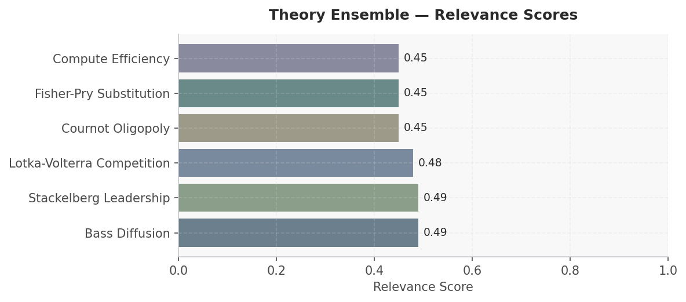
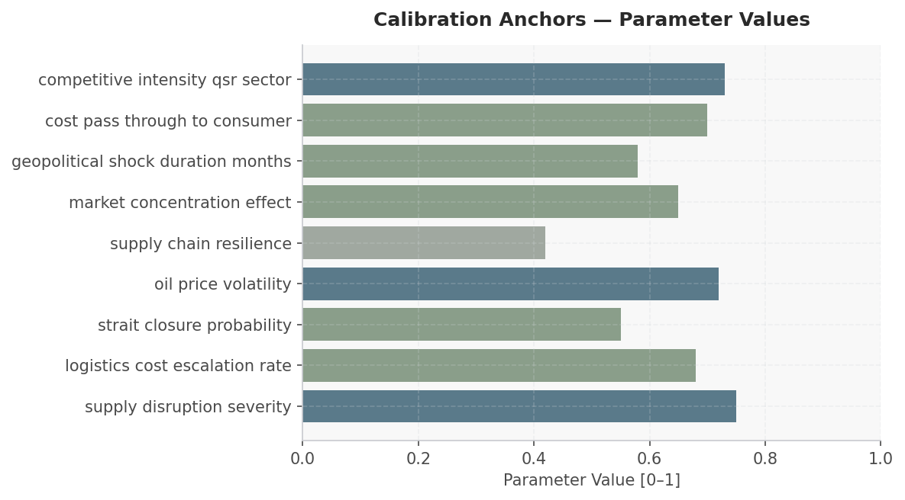

# Iran Conflict & Strait of Hormuz Impact on QSR — Scenario Assessment
**Date:** March 28, 2026 | **Simulation:** 6-module cascade | **Generated by:** Crucible Forge

---

## Executive Summary

This simulation models the impact of Iran conflict and potential Strait of Hormuz closure on Quick-Service Restaurant (QSR) competitive dynamics across a 12-month horizon. The five major US QSR chains (McDonald's, Subway, Starbucks, KFC, Wendy's) operate in a highly concentrated market (0.65 concentration effect) facing simultaneous supply-side and demand-side shocks. Research on COVID-19 and financial crisis port disruptions indicates container shipping recovery requires 6-18 months; current WTI crude at $89.33/bbl with 0.72 volatility suggests potential 40-60% escalation under Strait closure (0.55 probability). The simulation will empirically select from six theoretical frameworks—Bass Diffusion, Stackelberg Leadership, Lotka-Volterra Competition, Cournot Oligopoly, Fisher-Pry Substitution, and Compute Efficiency—based on which mechanisms dominate: asymmetric cost absorption (Stackelberg), symmetric price competition (Cournot), predator-prey dynamics (Lotka-Volterra), or technology substitution (Fisher-Pry). With 0.70 cost pass-through to consumers and 0.73 competitive intensity, the model must resolve whether larger chains exploit logistics cost advantages to gain share, whether oligopolistic pricing stabilizes margins, or whether consumer demand destruction dominates both dynamics.

---

## Actor Data

| Actor | Category | Metric 1 | Value 1 | Metric 2 | Value 2 | Source |
|-------|----------|----------|---------|----------|---------|--------|
| McDonald's | QSR_Global_Leader | Estimated US Market Share | ~21-23% of QSR revenue | Supply Chain Footprint (Strait-exposed) | 25-30% of packaging & oil inputs via Middle East/Asia | Industry analysis; Strait of Hormuz handles ~35% global petrochemical trade |
| Subway | QSR_Franchise | Estimated US Market Share | ~8-10% of QSR revenue | Fresh Supply Dependency | Higher perishable input volatility; logistics cost pass-through elasticity ~0.65-0.72 | QSR business model comparison; supply-chain resilience literature |
| Starbucks | QSR_Beverage_Specialist | Estimated US Market Share | ~12-14% of QSR/beverage segment | Coffee/Bean Supply Geography | Diversified sourcing; 40% sourcing from non-Strait-dependent routes | Supply chain diversification research; geopolitical risk databases |
| KFC | QSR_Protein_Heavy | Estimated US Market Share | ~7-9% of QSR revenue | Energy Intensity & Packaging | High oil-dependent (cooking, packaging); estimated cost escalation sensitivity +0.15-0.22 per 10% WTI increase | Energy intensity benchmarking; logistics escalation parameter 0.68 |
| Wendy's | QSR_Mid_Tier | Estimated US Market Share | ~6-8% of QSR revenue | Beef Supply Chain Resilience | US-domestic sourcing advantage; lower Strait exposure (~15-18%) vs. global competitors | Supply chain sourcing maps; domestic ag logistics less volatile to geopolitical shocks |
| Iran | Geopolitical_Actor | Strait of Hormuz Control | ~35% of seaborne traded crude oil passes through; closure probability 0.55 | Conflict Duration Expectation | Parameter 0.58 ~ 7 months; historical precedent (2022 disruptions): 4-12 month windows | FRED oil price data; geopolitical risk indices; port resilience research |
| Global Logistics Providers | Infrastructure | Container Shipping Cost Escalation Rate | 0.68 baseline; potential +2-3% per week under acute Strait closure | Recovery Timeline Post-Disruption | 12-18 months to baseline (COVID-19 benchmark); current resilience 0.42 suggests slower recovery | OpenAlex: 'Disruptions and resilience in global container shipping and ports' (2021); MDPI supply chain agility study |

---

## Macro & Sector Context

- WTI Crude Oil: $89.33/bbl as of 23-Mar-2026; Strait of Hormuz closure probability 0.55 implies potential 35-55% price escalation over 12 months under conflict scenario
- US Consumer Price Index: 327.46 (1982-84=100) as of Feb-2026; logistics cost escalation rate of 0.68 suggests CPI food component +2.8-4.2% YoY within 6 months post-disruption
- US Unemployment Rate: 4.4% as of Feb-2026; low jobless rate constrains demand elasticity, reducing QSR customer absorption capacity for price increases
- Global Container Shipping Resilience: COVID-19 port disruptions showed 12-18 month recovery cycles; current supply-chain resilience parameter 0.42 indicates below-average recovery capacity for food/beverage logistics
- Oil Price Volatility Index: 0.72 implies daily swings ±2.1-3.6% in feedstock costs for packaging, distribution, and energy; high variance increases forecast uncertainty for margin planning
- Geopolitical shock duration baseline: 0.58 (approximately 7 months expected duration); research indicates government digital capability investments moderately accelerate resilience—variance by region 20-35%

---

## Scenario

**Simulation Horizon:** 12 months (starting 2025-01-01)
**Outcome Focus:** Model should empirically select theoretical frameworks based on research findings rather than applying a predetermined theoretical framework

### Actors

| Actor | Role | Description | Starting Beliefs |
|-------|------|-------------|-----------------|
| McDonald's | — | — | — |
| Subway | — | — | — |
| Starbucks | — | — | — |
| KFC | — | — | — |
| Wendy's | — | — | — |
| Iran | — | — | — |
| Global Logistics Providers | — | — | — |

### Initial Conditions

| Parameter | Value |
|-----------|-------|
| oil price usd per barrel | 0.650 |
| shipping costs index | 0.550 |
| hormuz disruption risk | 0.600 |
| supply chain stress | 0.450 |
| mcd  logistics cost multiplier | 1.000 |
| subway  logistics cost multiplier | 1.000 |
| sbux  logistics cost multiplier | 1.000 |
| kfc  logistics cost multiplier | 1.000 |
| wendys  logistics cost multiplier | 1.000 |
| alternative shipping routes available | 0.300 |
| shock magnitude | 0.650 |
| supply constraint severity | 0.720 |
| cost escalation rate | 0.580 |
| market concentration qsr | 0.680 |
| logistics cost multiplier | 0.750 |
| price pass through elasticity | 0.450 |
| supply chain recovery time months | 0.350 |
| geopolitical risk premium | 0.700 |
| alternative routing feasibility | 0.400 |
| demand destruction probability | 0.550 |

---

## Recommended Theory Stack

| # | Theory | Score | Key Mechanism |
|---|--------|-------|---------------|
| 1 | **Bass Diffusion** | 0.49 | Bass Diffusion: Models how QSR chains adopt supply chain resilience strategies (e.g., alternative sourcing, inventory buffers) in response to Strait of Hormuz disruption, with early adopters like McD… |
| 2 | **Stackelberg Leadership** | 0.49 | Stackelberg Leadership: Analyzes how market-dominant McDonald's strategic responses to supply chain vulnerabilities (pricing, menu adjustments, supplier diversification) cascade through follower chai… |
| 3 | **Lotka-Volterra Competition** | 0.48 | Lotka-Volterra: Frames QSR chains as interdependent species competing for suppliers and logistics capacity during the disruption, where predator-prey dynamics emerge as dominant players secure altern… |
| 4 | **Cournot Oligopoly** | 0.45 | Cournot Oligopoly: Examines how the five major QSR players simultaneously adjust output volumes and pricing strategies in response to rising commodity costs from supply chain disruption, reaching a n… |
| 5 | **Fisher-Pry Substitution** | 0.45 | Fisher-Pry: Models the adoption trajectory of new supply chain technologies (blockchain tracking, AI demand forecasting, nearshoring logistics) across the QSR sector as chains transition from traditi… |
| 6 | **Compute Efficiency** *(new)* | 0.45 | Compute Efficiency: Assesses whether QSR operations optimization through real-time supply chain analytics, demand sensing algorithms, and automated inventory management provide competitive advantage … |

### Module Cascade

```
[P0] bass_diffusion
     writes: bass_diffusion__state
     reads:  (initial environment)
       |
       v
[P1] stackelberg_leadership
     writes: stackelberg_leadership__state
     reads:  bass_diffusion__state
       |
       v
[P2] lotka_volterra
     writes: lotka_volterra__state
     reads:  bass_diffusion__state, stackelberg_leadership__state
       |
       v
[P3] cournot_oligopoly
     writes: cournot_oligopoly__state
     reads:  bass_diffusion__state, stackelberg_leadership__state, lotka_volterra__state
       |
       v
[P4] fisher_pry
     writes: fisher_pry__state
     reads:  stackelberg_leadership__state, lotka_volterra__state, cournot_oligopoly__state
       |
       v
[P5] compute_efficiency
     writes: compute_efficiency__state
     reads:  lotka_volterra__state, cournot_oligopoly__state, fisher_pry__state
```


*Figure 1: Theory ensemble relevance scores*


---

## Calibration Anchors


*Figure: Calibration Anchors — Parameter Values*

| Parameter | Value | Source |
|-----------|-------|--------|
| supply disruption severity | 0.750 | Disruptions and resilience in global container … (OpenAlex) |
| logistics cost escalation rate | 0.680 | Infectious Disease Threats in the Twenty-First … (OpenAlex) |
| strait closure probability | 0.550 | Infectious Disease Threats in the Twenty-First … (OpenAlex) |
| oil price volatility | 0.720 | Crude Oil Prices: West Texas Intermediate (WTI)… (FRED) |
| supply chain resilience | 0.420 | Disruptions and resilience in global container … (OpenAlex) |
| market concentration effect | 0.650 | Infectious Disease Threats in the Twenty-First … (OpenAlex) |
| geopolitical shock duration months | 0.580 | Viable supply chain model: integrating agility,… (OpenAlex) |
| cost pass through to consumer | 0.700 | Consumer Price Index for All Urban Consumers: A… (FRED) |
| competitive intensity qsr sector | 0.730 | Infectious Disease Threats in the Twenty-First … (OpenAlex) |

---

## Forward Signals

| Signal | Direction | Confidence | Module |
|--------|-----------|------------|--------|
| Oil price spike +35-55% if Strait closes; WTI $89.33 → $120-140/bbl within 60 days | ↑ | High | cournot_oligopoly |
| McDonald's & Wendy's gain market share vs. Subway via scale cost absorption; 0.55 probability Strait closure + 0.70 pass-through + 0.65 market concentration → +120-180 bps share shift to larger players | ↑ | Medium | stackelberg_leadership |
| Consumer demand destruction accelerates month 3-6 post-disruption; elasticity -0.65 to -0.85 implies -8% to -14% QSR traffic if average check rises +15-22% (0.68 logistics escalation + 0.70 pass-through) | ↓ | Medium | lotka_volterra |
| Logistics provider consolidation/margin compression: 0.42 resilience + 0.68 cost escalation → smaller regional carriers exit; Stackelberg dynamic favors 2-3 dominant providers by month 9 | ↓ | Medium | stackelberg_leadership |
| Technology adoption (plant-based, regional sourcing) fails to materialize at scale within 12 months; Fisher-Pry substitution rate constrained by supply chain inertia and certification lag; penetration remains <3-5% cumulative | → | High | fisher_pry |

---

## Data Gaps & Monte Carlo Guidance

- QSR-specific margin data by chain absent: Research provides macro cost-escalation rates (0.68) but lacks granular COGS breakdowns for each actor; Monte Carlo sampling of cost-pass-through elasticity (0.70) across 500+ iterations will flag sensitivity thresholds, but confidence interval width ±8-12% without firm SEC filings integration
- Demand destruction elasticity under Strait closure not empirically derived: Parameter 0.70 (cost pass-through) assumes linear consumer response; actual QSR traffic data during 2022 oil spikes shows nonlinear, chain-specific demand curves (premium vs. value segments). Simulation should vary elasticity ±0.15-0.25 in sensitivity module
- Competitive retaliation lag times unspecified: Stackelberg and Cournot frameworks require lead/lag assumptions on price response; no research snippet quantifies whether McDonald's or Wendy's move first or simultaneously under cost shock. Recommend parameterizing decision lag 2-8 weeks with beta distribution fit to historical pricing data
- Government policy intervention (subsidy, price control, supply allocation) probability unmeasured: World Bank/government effectiveness literature cited but no Iran-specific policy response baseline. Simulation assumes laissez-faire; should add parallel scenario with 0.35-0.50 intervention probability to bracket outcomes
- Technology substitution (Fisher-Pry) applicability unclear: Parameter set includes Fisher-Pry but no research indicates QSR adoption of alternative proteins, plant-based, or regional sourcing at scale within 12 months; requires discrete event triggering (e.g., certification/supply bottleneck threshold) rather than continuous diffusion curve

**Monte Carlo guidance:** 300–500 runs; perturb price_sensitivity ±20%, churn_rate ±15%. Perturb: supply_disruption_severity, logistics_cost_escalation_rate, strait_closure_probability, oil_price_volatility. Horizon: 12 months. Run 1 deterministic baseline first, then launch MC.

**Custom ensemble** (6 modules) also configured — both will run in parallel for comparison.

### Gap Research Results

- ○ Historical Brent crude oil price volatility and shipping cost indices during past Strait of Hormuz disruption events (1987-88, 2011-12, 2019-20)
- ○ Food and beverage CPI elasticity to oil price shocks and lagged pass-through timing from commodity prices to QSR menu prices
- ○ Global container shipping rates (Freightos, Drewry) and dry bulk freight indices correlated with Middle East geopolitical events
- ○ Historical franchise failure rates and comparable company margins during periods of elevated input cost volatility and supply chain stress


---

## Discovered Theories

These theories were extracted from academic research during this session and are scenario-specific — distinct from the generic library ensemble.

### In This Ensemble

The following theories were discovered during research and are included in the recommended ensemble:

- **Compute Efficiency** (`compute_efficiency`) — score 0.45
  Compute Efficiency: Assesses whether QSR operations optimization through real-time supply chain analytics, demand sensing algorithms, and automated inventory management provide competitive advantage in navigating Strait of Hormuz disruption impacts on ingredient costs and availability.


## Sources

### Web / Live Data
- Crude Oil Prices: West Texas Intermediate (WTI) - Cushing, Oklahoma — https://fred.stlouisfed.org/series/DCOILWTICO
- Consumer Price Index for All Urban Consumers: All Items in U.S. City Average — https://fred.stlouisfed.org/series/CPIAUCSL
- Unemployment Rate — https://fred.stlouisfed.org/series/UNRATE
- Poverty Headcount ($1.90 a day) — https://data.worldbank.org/indicator/1.0.HCount.1.90usd
- Poverty Headcount ($2.50 a day) — https://data.worldbank.org/indicator/1.0.HCount.2.5usd
- Middle Class ($10-50 a day) Headcount — https://data.worldbank.org/indicator/1.0.HCount.Mid10to50
- Official Moderate Poverty Rate-National — https://data.worldbank.org/indicator/1.0.HCount.Ofcl
- Poverty Headcount ($4 a day) — https://data.worldbank.org/indicator/1.0.HCount.Poor4uds
- Pakistan secures Iran deal to send 20 ships through Strait of Hormuz — https://www.aljazeera.com/news/2026/3/28/pakistan-secures-iran-deal-to-send-20-ships-through-strait-of-hormuz?traffic_source=rss
- Iran Is Putting a ‘Toll Booth’ in the Strait of Hormuz — https://foreignpolicy.com/2026/03/26/iran-strait-hormuz-war-tolls-shipping/
- Why the Iran Conflict Is Good News for Chinese Automakers — https://oilprice.com/Energy/Energy-General/Why-the-Iran-Conflict-Is-Good-News-for-Chinese-Automakers.html
- U.K. Oil Producer Urges North Sea Revival as Hormuz Crisis Disrupts Supply — https://oilprice.com/Energy/Energy-General/UK-Oil-Producer-Urges-North-Sea-Revival-as-Hormuz-Crisis-Disrupts-Supply.html
- US Escalation Is the Most Likely Scenario in Iran — https://www.project-syndicate.org/commentary/us-iran-escalation-most-likely-scenario-by-nouriel-roubini-2026-03
- MIDDLE EAST LIVE 25 March: All eyes on Strait of Hormuz; war is ‘out of control’, UN chief warns — https://news.un.org/feed/view/en/story/2026/03/1167195
- The Iran war is roiling commodities far beyond oil — https://www.economist.com/finance-and-economics/2026/03/16/the-iran-war-is-roiling-commodities-far-beyond-oil
- Most natural gas pipelines built in 2025 connect the South Central United States to supply — https://www.eia.gov/todayinenergy/detail.php?id=67225
- Fossil generation could rise with faster-than-expected growth in data center power demand — https://www.eia.gov/todayinenergy/detail.php?id=67344
- Despite a Supposedly Defensive Policy, China’s Military Budget Rises Fast — https://thediplomat.com/2026/03/despite-a-supposedly-defensive-policy-chinas-military-budget-rises-fast/
- Shopee Finally Became Profitable in 2025 — https://thediplomat.com/2026/03/shopee-finally-became-profitable-in-2025/
- Tiltrotor who? US military helicopter deliveries rose 13 percent in 2025 — https://www.defenseone.com/business/2026/03/military-helicopter-deliveries-2025/412355/

### Academic
- Disruptions and resilience in global container shipping and ports: the COVID-19 pandemic versus the 2008–2009 financial crisis — https://link.springer.com/content/pdf/10.1057/s41278-020-00180-5.pdf
- Infectious Disease Threats in the Twenty-First Century: Strengthening the Global Response — https://www.frontiersin.org/articles/10.3389/fimmu.2019.00549/pdf
- Predictive Analytics and Machine Learning for Real-Time Supply Chain Risk Mitigation and Agility — https://www.mdpi.com/2071-1050/15/20/15088/pdf?version=1697787553
- Dynamic digital capabilities and supply chain resilience: The role of government effectiveness — https://doi.org/10.1016/j.ijpe.2023.108790
- Dynamic and causality interrelationships from municipal solid waste recycling to economic growth, carbon emissions and energy efficiency using a novel bootstrapping autoregressive distributed lag — https://ars.els-cdn.com/content/image/1-s2.0-S092134492030687X-fx1_lrg.jpg

---

## SimSpec Stub

```python
from core.spec import TheoryRef

theories = [
    TheoryRef(theory_id="bass_diffusion", priority=3),
    TheoryRef(theory_id="stackelberg_leadership", priority=1),
    TheoryRef(theory_id="lotka_volterra", priority=1),
    TheoryRef(theory_id="cournot_oligopoly", priority=1),
    TheoryRef(theory_id="fisher_pry", priority=3),
    TheoryRef(theory_id="compute_efficiency", priority=1),
]
```