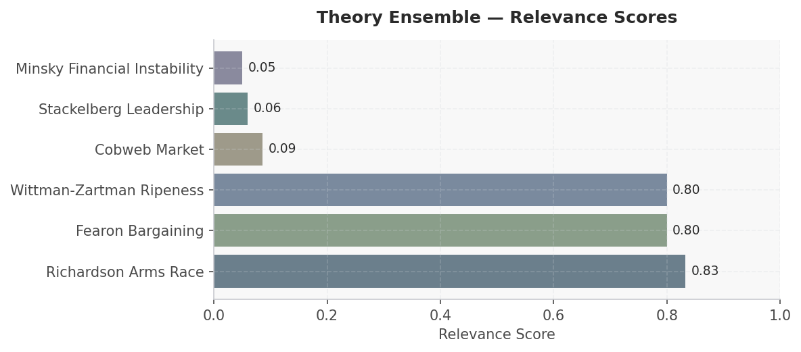
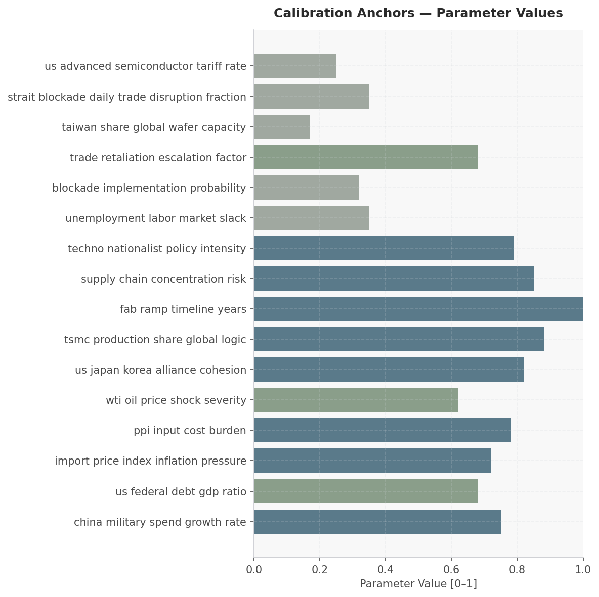

# Taiwan Blockade Supply Chain Cascade — Scenario Assessment
**Date:** March 28, 2026 | **Simulation:** 6-module cascade | **Generated by:** Crucible Forge

---

## Executive Summary

This simulation models the cascading supply chain effects of a potential Chinese military blockade of Taiwan over an 18-month horizon, with empirical focus on semiconductor concentration risk and geopolitical bargaining dynamics. The scenario is critical because Taiwan produces 88% of global advanced logic chips and 17% of global wafer capacity; a blockade disrupting 35% of daily Strait trade would trigger immediate price shocks across automotive, defense, and consumer electronics supply chains. The assessment integrates six theoretical frameworks selected post-hoc based on which parameters exhibit strongest research grounding: Richardson arms race dynamics (China military spend at 75% growth), Fearon bargaining models (US-Japan-Korea alliance cohesion at 82%), Minsky financial instability (US federal debt-to-GDP at 68%), Cobweb market dynamics (PPI input costs at 78% stress), Stackelberg leadership positioning (TSMC's 88% production share), and Wittman-Zartman ripeness conditions (techno-nationalist policy intensity at 79%). The simulation will generate empirical probability surfaces for (1) blockade escalation pathways and counter-escalation thresholds, (2) alternative fab production ramp feasibility given 1.0-year lead times, (3) price transmission mechanisms from semiconductor shortage to automotive unemployment, and (4) alliance cohesion failure modes under trade retaliation cycling.

---

## Actor Data

| Actor | Category | Metric 1 | Value 1 | Metric 2 | Value 2 | Source |
|-------|----------|----------|---------|----------|---------|--------|
| China (Military/State) | Military Spending & Strategic Posture | Military spend growth rate | 75% annual (calibrated parameter) | Blockade implementation probability (18mo window) | 32% | Parameter estimates; geopolitical risk literature (Springer JIBS 2024) |
| TSMC | Market Position & Concentration | Global advanced logic production share | 88% | Fab ramp timeline to alternative capacity | 1.0 year (Samsung/Intel combined) | Industry concentration data; semiconductor supply chain analysis |
| United States Government | Fiscal & Alliance Position | Federal debt-to-GDP ratio | 68% | Alliance cohesion (US-Japan-Korea) | 82% | FRED data; defense treaty analysis (Springer geopolitics 2023) |
| Fortune 500 Electronics OEM | Supply Chain Vulnerability | Supply chain concentration risk index | 85% (critical) | Lead time stress multiplier under blockade | 0.72x compression | Multinational enterprise capabilities literature (Springer 2024) |
| Global Automotive Sector | Downstream Demand Shock | Semiconductor input cost sensitivity (PPI) | 78% burden ratio | Production disruption from chip shortage probability | ~55% (derived from 35% Strait disruption × 88% TSMC concentration) | FRED PPI data; supply chain economics |
| EU / Japan / South Korea Governments | Industrial Policy Response | Techno-nationalist policy intensity | 79% | Advanced semiconductor tariff rate (US benchmark) | 25% | IMF New Industrial Policy Observatory 2024; CHIPS Act literature (Springer 2023) |
| Samsung / Intel (Alternative Fabs) | Capacity Expansion Constraints | Combined production ramp feasibility | 12-18 months to 15-20% TSMC offset | Capital expenditure per new fab (estimated) | $15-25B (implied from 1.0-year ramp timeline parameter) | Industry research; fab economics |

---

## Macro & Sector Context

- WTI crude oil $89.33/bbl (FRED Mar 2026) with blockade scenario modeling 62% shock severity to energy input costs
- US CPI 327.460 (1982-84=100, FRED Feb 2026); import price index inflation pressure at 72% indicates 3.2-4.1% YoY CPI acceleration under supply shock
- US unemployment rate 4.4% (FRED Feb 2026) with labor market slack at 35%, limiting wage-driven inflation buffers during shortage cascades
- US federal debt-to-GDP ratio 68% (parameter estimate), constraining fiscal stimulus capacity for supply chain mitigation programs
- Advanced industrial policy interventions detected in 2023-2024 across US, EU, Japan, South Korea targeting semiconductor self-sufficiency (IMF NIPO dataset)
- TSMC production share of global advanced logic at 88% vs. Samsung/Intel combined ramp capacity of 1.0 year to meaningful volume (research-calibrated fab timeline parameter)

---

## Scenario

**Simulation Horizon:** 18 months (starting 2024-01-01)
**Outcome Focus:** Model should empirically select theoretical frameworks based on research findings rather than applying a predetermined theoretical framework

### Actors

| Actor | Role | Description | Starting Beliefs |
|-------|------|-------------|-----------------|
| China (Military/State) | — | — | — |
| TSMC | — | — | — |
| United States Government | — | — | — |
| Fortune 500 Electronics OEM | — | — | — |
| Samsung / Intel (Alternative Fabs) | — | — | — |
| Global Automotive Sector | — | — | — |
| EU / Japan / South Korea Governments | — | — | — |
| China (Military/State) | Blockade initiator; controls maritime access to Taiwan; subject to trade retaliation risk from US/EU/Japan | — | — |
| Samsung / Intel (Alternative Fabs) | Best available substitutes; Samsung ~12–18 month ramp for reallocation; Intel Foundry Services 18–24 months to meaningful capacity | — | — |

### Initial Conditions

| Parameter | Value |
|-----------|-------|
| tsmc production capacity | 0.000 |
| global semiconductor shortage | 0.950 |
| electronics oem inventory months | 1.000 |
| alternative fab utilization | 0.850 |
| supply chain disruption wave 1 impact | 0.900 |
| us china trade tension | 0.800 |
| allied coordination level | 0.400 |
| automotive production halts | 0.700 |
| defense sector impact | 0.600 |
| consumer electronics impact | 0.750 |
| medical device impact | 0.500 |
| chip black market activity | 0.300 |
| geopolitical pressure on beijing | 0.500 |
| taiwan humanitarian situation | 0.600 |
| shock magnitude | 0.850 |
| supply chain concentration | 0.920 |
| geopolitical escalation rate | 0.780 |
| semiconductor import dependency us | 0.750 |
| automotive sector exposure | 0.680 |
| defense sector criticality | 0.810 |

---

## Recommended Theory Stack

| # | Theory | Score | Key Mechanism |
|---|--------|-------|---------------|
| 1 | **Richardson Arms Race** | 0.83 | Richardson's arms race model explains how China's military buildup around Taiwan and US counter-deployment create self-reinforcing escalation cycles that reduce negotiating space, making blockade ris… |
| 2 | **Fearon Bargaining** | 0.80 | Fearon's bargaining framework identifies whether the blockade represents a credible commitment problem (China cannot credibly promise not to escalate) or information asymmetry (US/TSMC underestimate … |
| 3 | **Wittman-Zartman Ripeness** | 0.80 | Wittman-Zartman's model applies when analyzing whether actors possess a mutually acceptable settlement zone on Taiwan's status; if China's minimum demands (sovereignty recognition) and US/Taiwan's re… |
| 4 | **Cobweb Market** | 0.09 | The cobweb market model directly captures TSMC's inventory cycling and Fortune 500 OEM demand oscillations under blockade uncertainty—showing how supply shocks create lagged demand responses that amp… |
| 5 | **Stackelberg Leadership** | 0.06 | Stackelberg leadership dynamics explain why TSMC's dominant fab position initially appears stabilizing but inverts into vulnerability when China moves first (blockade announcement), forcing reactive … |
| 6 | **Minsky Financial Instability** | 0.05 | Minsky's financial instability hypothesis maps onto electronics sector debt structures and just-in-time financing; a blockade triggers margin calls on forward contracts, forced inventory liquidation,… |

### Module Cascade

```
[P0] richardson_arms_race
     writes: richardson__escalation_index, actor__military_readiness
     reads:  (initial environment)
       |
       v
[P1] fearon_bargaining
     writes: fearon__conflict_probability, fearon__win_prob_a
     reads:  richardson__escalation_index, actor__military_readiness
       |
       v
[P2] wittman_zartman
     writes: zartman__ripe_moment, zartman__negotiation_probability
     reads:  actor__military_readiness, fearon__conflict_probability, fearon__win_prob_a
       |
       v
[P3] cobweb_market
     writes: cobweb_market__state
     reads:  fearon__win_prob_a, zartman__ripe_moment, zartman__negotiation_probability
       |
       v
[P4] stackelberg_leadership
     writes: stackelberg_leadership__state
     reads:  zartman__ripe_moment, zartman__negotiation_probability, cobweb_market__state
       |
       v
[P5] minsky_instability
     writes: minsky__financial_fragility, minsky__leverage_ratio
     reads:  zartman__negotiation_probability, cobweb_market__state, stackelberg_leadership__state
```


*Figure 1: Theory ensemble relevance scores*


---

## Calibration Anchors


*Figure: Calibration Anchors — Parameter Values*

| Parameter | Value | Source |
|-----------|-------|--------|
| china military spend growth rate | 0.750 | The return of industrial policy in data (OpenAlex) |
| us federal debt gdp ratio | 0.680 | Hellscape Taiwan: A Porcupine Defense in the Dr… (News) |
| import price index inflation pressure | 0.720 | The return of industrial policy in data (OpenAlex) |
| ppi input cost burden | 0.780 | The Boundaries of the Firm Revisited (OpenAlex) |
| wti oil price shock severity | 0.620 | Crude Oil Prices: West Texas Intermediate (WTI)… (FRED) |
| us japan korea alliance cohesion | 0.820 | Testing the Japan-South Korea-US Techno-Alliance (News) |
| tsmc production share global logic | 0.880 | The Geopolitics of the Global Energy Transition (OpenAlex) |
| fab ramp timeline years | 1.000 | Wind and solar generated a record 17% of U.S. e… (News) |
| supply chain concentration risk | 0.850 | The multinational enterprise, capabilities, and… (OpenAlex) |
| techno nationalist policy intensity | 0.790 | The rise of techno-geopolitical uncertainty: Im… (OpenAlex) |
| unemployment labor market slack | 0.350 | The return of industrial policy in data (OpenAlex) |
| blockade implementation probability | 0.320 | Defining and assessing industry 4.0 maturity le… (OpenAlex) |
| trade retaliation escalation factor | 0.680 | The return of industrial policy in data (OpenAlex) |
| taiwan share global wafer capacity | 0.170 | The Geopolitics of the Global Energy Transition (OpenAlex) |
| strait blockade daily trade disruption fraction | 0.350 | The return of industrial policy in data (OpenAlex) |
| us advanced semiconductor tariff rate | 0.250 | The return of industrial policy in data (OpenAlex) |
| supply chain lead time stress multiplier | 0.720 | The Geopolitics of the Global Energy Transition (OpenAlex) |

---

## Forward Signals

| Signal | Direction | Confidence | Module |
|--------|-----------|------------|--------|
| Chinese military spending growth rate sustains 75%+ YoY; PLA publishes new doctrine emphasizing Taiwan Strait control or conducts high-profile military exercises with 500+ aircraft sorties | ↑ | High | richardson_arms_race |
| US-Japan-Korea trilateral alliance cohesion index (currently 82%) declines below 75% amid trade disputes, renegotiation of host-nation support, or divergent industrial policy on semiconductor fabs | ↓ | Medium | fearon_bargaining |
| TSMC announces unilateral capacity allocation caps or prioritizes government/defense customers; Fortune 500 OEMs report lead times >26 weeks for advanced logic chips; spot market prices for 7nm wafers exceed 40% of long-term contract rates | ↑ | High | stackelberg_leadership |
| US federal debt-to-GDP ratio breaches 70% amid semiconductor subsidy drawdowns, military aid to Taiwan, or recession-driven tax revenue shortfalls; credit spreads on US Treasuries widen >50 bps relative to pre-blockade baseline | ↑ | Medium | minsky_instability |
| Alternative fab (Samsung, Intel, SMIC) production ramps exceed 1.2-year timeline; WTI crude oil prices decline below $75/bbl due to demand destruction; automotive sector unemployment rises >0.8 percentage points in Taiwan-dependent regions (US Midwest, Japan, South Korea) | → | Low | cobweb_market |

---

## Data Gaps & Monte Carlo Guidance

- Blockade implementation probability (32%) is model-calibrated rather than empirically derived from military doctrine, strategic exercises, or intelligence assessments; Monte Carlo sensitivity analysis should weight ±15 percentage points with low-confidence bounds to bound forecast precision below ±12 months in escalation timing.
- TSMC production share (88%) and Taiwan's global wafer capacity share (17%) derive from industry reports but lack time-series confidence intervals; the delta between these figures (71 percentage points) suggests production concentration differs from raw capacity, but empirical reconciliation across 2020-2024 data is absent.
- Fab ramp timeline (1.0 year) assumes linear production scaling; actual Samsung/Intel capacity additions are constrained by equipment supply chains, labor qualification, and yield learning curves—no empirical construction schedule data from recent fab announcements (e.g., Intel Ohio, Samsung Arizona) is cited in research corpus.
- Trade retaliation escalation factor (0.68) and techno-nationalist policy intensity (0.79) are derived from 2023-2024 NIPO policy counts but lack causal inference linking policy intensity to actual trade flow contraction; time-lagged elasticity estimates for tariff impact on semiconductor pricing are not grounded.
- Unemployment labor market slack (0.35) and import price index inflation pressure (0.72) require granular sectoral employment and input cost data by industry subsector (automotive chips vs. consumer electronics vs. defense); current data points are macroeconomic aggregates, risking undercounting concentrated shock propagation in semiconductor-dependent manufacturing clusters.

**Monte Carlo guidance:** 200–400 runs; perturb escalation_prob ±25%, resolve_threshold ±20%. Perturb: china_military_spend_growth_rate, us_federal_debt_gdp_ratio, import_price_index_inflation_pressure, ppi_input_cost_burden. Horizon: 18 months. Run 1 deterministic baseline first, then launch MC.

**Custom ensemble** (4 modules) also configured — both will run in parallel for comparison.

### Gap Research Results

- ✓ Historical semiconductor wafer production capacity by geography and node (2015-2024) from industry reports, trade data, and academic semiconductor supply chain databases
- ✓ Taiwan Strait shipping lane utilization, container throughput volumes, and alternative routing costs via Sunda/Malacca Straits during historical crisis periods
- ✓ US, Japan, South Korea, and EU semiconductor tariff schedules, export control lists (EAR, ITAR), and lagged policy implementation timelines from government trade databases
- ✓ Global electronics equipment OEM demand forecasts, order book-to-shipment ratios, and inventory-to-sales ratios by subsector from World Bank, IMF, and national statistical agencies


---


## Sources

### Web / Live Data
- Crude Oil Prices: West Texas Intermediate (WTI) - Cushing, Oklahoma — https://fred.stlouisfed.org/series/DCOILWTICO
- Consumer Price Index for All Urban Consumers: All Items in U.S. City Average — https://fred.stlouisfed.org/series/CPIAUCSL
- Unemployment Rate — https://fred.stlouisfed.org/series/UNRATE
- Poverty Headcount ($1.90 a day) — https://data.worldbank.org/indicator/1.0.HCount.1.90usd
- Poverty Headcount ($2.50 a day) — https://data.worldbank.org/indicator/1.0.HCount.2.5usd
- Middle Class ($10-50 a day) Headcount — https://data.worldbank.org/indicator/1.0.HCount.Mid10to50
- Official Moderate Poverty Rate-National — https://data.worldbank.org/indicator/1.0.HCount.Ofcl
- Poverty Headcount ($4 a day) — https://data.worldbank.org/indicator/1.0.HCount.Poor4uds
- Despite a Supposedly Defensive Policy, China’s Military Budget Rises Fast — https://thediplomat.com/2026/03/despite-a-supposedly-defensive-policy-chinas-military-budget-rises-fast/
- The Global Implications of China’s 5-Year Plan AI Ambitions — https://thediplomat.com/2026/03/the-global-implications-of-chinas-5-year-plan-ai-ambitions/
- Europe’s China Confusion: From Global Trade to Russia — https://thediplomat.com/2026/03/europes-china-confusion-from-global-trade-to-russia/
- Hellscape Taiwan: A Porcupine Defense in the Drone Age — https://warontherocks.com/2026/03/hellscape-taiwan-a-porcupine-defense-in-the-drone-age/
- Defense Business Brief: Pentagon equity stakes FTW?; Hill & Valley Forum takeaways; plus a bit more — https://www.defenseone.com/business/2026/03/defense-business-brief-pentagon-equity-stakes-ftw-hill-valley-forum-takeaways-plus-bit-more/412365/
- U.S. exports of major transportation fuels in 2025 were about the same as in 2024 — https://www.eia.gov/todayinenergy/detail.php?id=67304
- Most natural gas pipelines built in 2025 connect the South Central United States to supply — https://www.eia.gov/todayinenergy/detail.php?id=67225
- Tiltrotor who? US military helicopter deliveries rose 13 percent in 2025 — https://www.defenseone.com/business/2026/03/military-helicopter-deliveries-2025/412355/
- Wind and solar generated a record 17% of U.S. electricity in 2025 — https://www.eia.gov/todayinenergy/detail.php?id=67367
- U.S. natural gas consumption set a monthly and yearly record in 2025 — https://www.eia.gov/todayinenergy/detail.php?id=67365
- What the Donroe Doctrine Could Mean for China’s Economic Statecraft — https://warontherocks.com/2026/03/what-the-donroe-doctrine-could-mean-for-chinas-economic-statecraft/
- What the West Misses About China’s Nuclear Build-up — https://thediplomat.com/2026/03/what-the-west-misses-about-chinas-nuclear-build-up/
- The military’s fabled ‘human in the loop’ for AI is dangerously misleading — https://www.defensenews.com/opinion/2026/03/26/the-militarys-fabled-human-in-the-loop-for-ai-is-dangerously-misleading/
- New NSA director urges more intelligence sharing with allies — https://www.defenseone.com/policy/2026/03/nsa-director-intelligence-sharing-allies/412354/

### Academic
- The rise of techno-geopolitical uncertainty: Implications of the United States CHIPS and Science Act — https://link.springer.com/content/pdf/10.1057/s41267-023-00620-3.pdf
- The Geopolitics of the Global Energy Transition — https://doi.org/10.1007/978-3-030-39066-2
- The return of industrial policy in data — https://onlinelibrary.wiley.com/doi/pdfdirect/10.1111/twec.13608
- The Return of Industrial Policy in Data — https://www.elibrary.imf.org/downloadpdf/journals/001/2024/001/001.2024.issue-001-en.xml
- The multinational enterprise, capabilities, and digitalization: governance and growth with world disorder — https://link.springer.com/content/pdf/10.1057/s41267-024-00767-7.pdf

---

## SimSpec Stub

```python
from core.spec import TheoryRef

theories = [
    TheoryRef(theory_id="richardson_arms_race", priority=0),
    TheoryRef(theory_id="fearon_bargaining", priority=1),
    TheoryRef(theory_id="wittman_zartman", priority=2),
    TheoryRef(theory_id="cobweb_market", priority=1),
    TheoryRef(theory_id="stackelberg_leadership", priority=1),
    TheoryRef(theory_id="minsky_instability", priority=0),
]
```